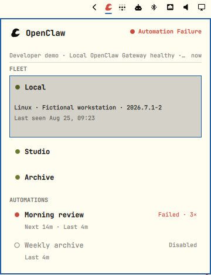

# Clawbar

Clawbar is a read-only OpenClaw Fleet signal board for the Omarchy bar. It
collects bounded Operational Metadata from one configured Gateway, then renders
the cached snapshot without blocking Quickshell.



## Requirements

- Omarchy with the Quickshell plugin commands (`omarchy plugin ...`)
- OpenClaw `2026.7.1-2` or a later stable release with the same supported JSON
  command surfaces
- Python 3; the collector uses only the standard library
- Optional: Tailscale for the verified fallback setup when OpenClaw cannot
  resolve a local, configured remote, or Node-host Gateway

Clawbar does not install a Python package, daemon, systemd service, or timer.
One Quickshell service entry point owns the bounded collection schedule.

## Install

```sh
omarchy plugin add https://github.com/yasuhito/clawbar.git --enable
```

The widget is placed in the right bar section. Enabling it starts one immediate
collection and repeats every 30 seconds. OpenClaw first resolves its normal
local or configured remote Gateway. If that fails on a Node host, Clawbar uses
the Gateway connection recorded in OpenClaw-owned Node-host state; it never
probes Fleet Nodes directly and never stores a Gateway token.

If none of those sources resolves a Gateway, the panel shows Gateway Setup
Required and lists online Tailscale devices under stable, opaque candidate
keys. Select a device with `j`/`k` or the arrow keys and press Enter. Clawbar
accepts it only after the bounded, read-only Gateway JSON probe succeeds. A
verified target is reused for later collections; Clawbar never asks for or
stores a Gateway token or password.
Without Tailscale, the panel stays in the non-Incident setup state and gives
instructions to connect Tailscale and refresh.

## Configure

Set `CLAWBAR_REFRESH_INTERVAL_SECONDS` before starting Omarchy Shell to change
the interval. Accepted values are 15 through 300 seconds.

```sh
export CLAWBAR_REFRESH_INTERVAL_SECONDS=60
omarchy restart shell
```

The whole collection has a 12-second deadline. A slow or unavailable Gateway
cannot accumulate overlapping collector processes or block the bar. A healthy
snapshot becomes Stale after three configured refresh intervals.

## Use

Press Clawbar to open the panel.

- `j`, `k`, Up, Down: move selection
- Enter: expand or collapse the selected Node, or verify a selected Gateway candidate
- `r`: request a non-blocking refresh
- `o`: open official read-only recent-run history for the selected Automation
- Escape: close the panel
- Middle-click the bar widget: request a non-blocking refresh

The bar count is the number of Working Agents while healthy and the number of
current Attention Items while yellow or red. Agent Activity and the previous
Task Result remain independent. Automation Failure and Offline Node conditions
appear once in their natural tree section.

## Privacy boundary

Clawbar persists only Operational Metadata: generalized health states, bounded
Node and Agent display names, model/runtime labels, Automation schedule
metadata, timestamps, and opaque local UI keys. It discards raw command output
after parsing.

Clawbar never persists or displays task instructions, message bodies,
destinations, account identifiers, credentials, host/IP/private Node or
Tailscale identifiers, or raw errors. Tailscale device identifiers are HMACed
with Clawbar's local secret into stable candidate keys before entering a
snapshot. QML reads only `$XDG_STATE_HOME/clawbar/snapshot.json` (or
`~/.local/state/clawbar/snapshot.json`). Private mode-`0600` state beside the
snapshot maps those opaque keys to Tailscale targets and remembers a verified
target URL; it contains no token, password, or other credential. Incident
deduplication state and the local key secret are per-login data under
`XDG_RUNTIME_DIR`.

The only context action invokes OpenClaw's official read-only Automation run
history command for an ID already present in the current snapshot. Clawbar
cannot create, edit, retry, cancel, enable, disable, or delete OpenClaw work.

## Update, disable, and remove

```sh
omarchy plugin update io.github.yasuhito.clawbar --yes
omarchy plugin disable io.github.yasuhito.clawbar
omarchy plugin remove io.github.yasuhito.clawbar --yes
```

Disable and remove unload the Quickshell service immediately, stopping future
collection and notification scheduling. A collector already inside its bounded
request exits within 12 seconds. No systemd unit, timer, or background daemon is
left behind.

## Developer demonstration

`scripts/clawbar_demo.py` pauses Gateway collection for the desktop login and
writes fictional, sanitized snapshots through the same atomic snapshot seam
used by the collector. The panel labels these snapshots `Developer demo` so
they cannot be mistaken for current Gateway data. This is a development tool,
not a user-facing mode. Run a scenario, open the actual Omarchy panel, and
repeat for all twelve accepted states:

```sh
python scripts/clawbar_demo.py setup-required
python scripts/clawbar_demo.py healthy
python scripts/clawbar_demo.py working-agents
python scripts/clawbar_demo.py unstable-gateway
python scripts/clawbar_demo.py offline-gateway
python scripts/clawbar_demo.py degraded-gateway
python scripts/clawbar_demo.py configuration-error
python scripts/clawbar_demo.py automation-failure
python scripts/clawbar_demo.py stale-snapshot
python scripts/clawbar_demo.py empty-fleet
python scripts/clawbar_demo.py grouped-incidents
python scripts/clawbar_demo.py recovery
```

Resume normal scheduled collection after review:

```sh
python scripts/clawbar_demo.py --resume
```

`grouped-incidents` starts one grouped notification for two Offline Nodes and
one Automation Failure. `recovery` restores a healthy Fleet and emits one
grouped recovery notification. Use `j`/`k`, Enter, and `o` while reviewing the
panel; `o` remains a read-only OpenClaw handoff and may report unavailable for
fictional Automation IDs.

For release review, exercise each scenario in the actual shell at narrow and
wide panel widths on `white`, `catppuccin-latte`, `flexoki-light`, and
`vantablack`, then repeat once with reduced motion. Confirm immediate panel
navigation while a delayed collector runs and check the shell console for QML
errors.

## Marketplace

- Category: `Widgets`
- Tags: `ai`, `bar`, `quickshell`
- License: MIT
