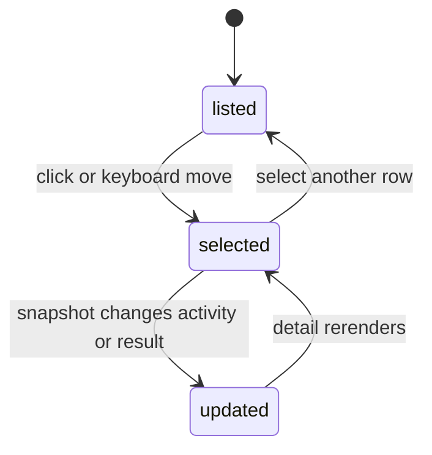

# Agent Activity and Task Results

## Summary

The Agents section shows each Agent's current Agent Activity and previous Task Result as independent facts. Selecting an Agent expands both plus completion and observation timestamps. Agents are not placed under Nodes, and Clawbar exposes no Task content or controls.

## The simple case

A Working Agent appears with a working-color signal and `Working`. Its second line can simultaneously say `Task: Failed · 9m`, describing the previous completed Task rather than current work. Selecting the Agent expands `Activity Working`, `Task result Failed`, and timestamps.

Idle Agents use a quiet muted outline ring and omit the repeated `Idle` row label, while Waiting uses warning color and visible text. Selecting an Idle Agent still expands `Activity Idle`. If no Agents exist, the entire section heading is omitted.

## The action, event by event

### Ready

Current or Last Known Agent metadata provides named rows and stable bounded keys.

### Invoked

Click or keyboard movement selects an Agent. Enter does nothing; inspection is read-only.

### Waiting begins

Selection settles immediately. New activity and results arrive only through Snapshot collection.

### While waiting

The current row remains navigable during collection. Activity does not animate as a live stream; it changes when the next Snapshot is consumed.

### Settled

Detail states Activity and Task Result separately. `None` means no previous completed result is available. Missing completion time says `No completion timestamp`; available times use local absolute formatting.

## Variants

| Variant | At invocation | If it changes while waiting |
| --- | --- | --- |
| Input method | Pointer selects exactly; keyboard moves through shared order. | Both preserve one Selection. |
| Panel visibility | Open panel is required for detail. | Closing does not affect Agent work. |
| Snapshot freshness | Current rows report current activity; historical rows say Last known. | Historical transition changes emphasis and observation age. |
| Gateway state | Current Agents require available metadata; failed states may use Last Known data. | Degraded unavailability removes current Agent rows. |

## Cancel and interrupt

| Event | Before waiting | While waiting |
| --- | --- | --- |
| Escape or closing the panel | Hides Agent detail. | Agent work and collection continue. |
| Starting another Clawbar Action | Selection can move; refresh observes later state. | No command is sent to the Agent. |
| A scheduled or manual refresh completing | Updates activity, result, times, order, and Selection. | Same. |
| Omarchy Shell losing focus, restarting, or exiting | Stops panel input only. | Agent remains managed by OpenClaw. |
| The snapshot changing, becoming stale, or becoming unreadable | Valid change rerenders; unreadable input preserves memory. | Can turn rows historical or unavailable. |
| The plugin being disabled, updated, or removed | Removes observation. | Does not cancel Tasks. |
| Switching between pointer and keyboard input | No effect beyond Selection route. | No effect. |
| Gateway resolution or reachability changing | Not direct Agent state. | Later Snapshot supplies current or Last Known metadata. |

## Interactions with other systems

**Privacy boundary.** Agent names, bounded model metadata, activity, result, and timestamps may be reduced; Task instructions, destinations, accounts, workspaces, and raw errors are excluded.

**Collection and freshness.** Agent and Task surfaces are collected together for reduction. Failure makes Agent metadata unavailable and degrades the Gateway.

**Selection and navigation.** Agent rows follow Nodes and precede Automations. Empty Agents add no heading or rows.

**Notifications and Incidents.** Failed Task Result and Waiting or Idle activity are not Attention Items or Incidents.

**Theme and accessibility.** Working uses an accent signal and text, Waiting uses a warning signal and text, and Idle uses a muted outline ring with `Idle` retained in the accessible description and selected detail. Failed result uses urgent color and bold text.

**Plugin lifecycle.** Clawbar lifecycle never starts, stops, retries, or cancels Agent Tasks.

## Edge cases

- Working plus previous Failed is valid and intentionally displayed together.
- Idle plus previous Succeeded remains visible as two independent facts.
- An Agent with no completed Task says `Task: None` and `No completion timestamp` in detail.
- Multiple Task records are reduced to current activity and the most relevant completed result without exposing content.
- Historical Working describes the last observed activity, not a claim that work continues.
- Empty Agent data omits the section instead of saying `No Agents`.

## Open questions and verification

- Confirm sorting and stable selection when Agent order changes; source tests cover order preservation but not every live reorder.
- Confirm the muted Idle ring, omitted row label, and expanded `Activity Idle` presentation in the running panel.
- Confirm screen-reader descriptions for Agent Activity and failed Task Result.
- Confirm whether omitting `No Agents` is consistent with user expectations beside explicit empty Fleet and Automations states.

Verified against Clawbar commit `f08496e`.
