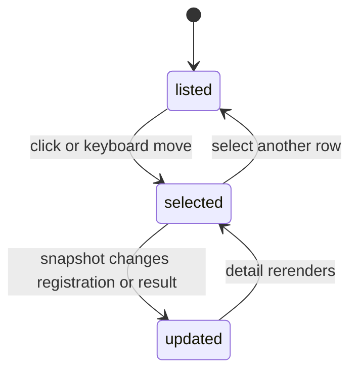

# Agent registration and Task Results

## Summary

The Agents section lists each Registered Agent reported by the Gateway. A static green dot confirms only that the registration was reported; it does not claim health, online presence, or current activity. Selecting an Agent expands its previous Task Result plus completion and observation timestamps. Agents are not placed under Nodes, and Clawbar exposes no Task content or controls.

## The simple case

A Registered Agent appears with a static green dot, its name, and a second line such as `Task: Failed · 9m`. The green dot is a registration marker, while the Task Result describes the latest completed Task. Selecting the Agent expands `Task result Failed`, `Completed …`, and `Observed …` without displaying Working, Waiting, or Idle.

If no Agents are reported, the entire section heading is omitted.

## The action, event by event

### Ready

Current or Last Known Agent metadata provides named rows and stable bounded keys.

### Invoked

Click or keyboard movement selects an Agent. Enter does nothing; inspection is read-only.

### Waiting begins

Selection settles immediately. Registrations and Task Results change only when a new Snapshot is consumed.

### While waiting

The current row remains navigable during collection. The registration marker is static and does not animate as a live activity stream.

### Settled

Detail states Task Result without claiming current activity. `None` means no previous completed result is available. Missing completion time says `No completion timestamp`; available completion and observation times use compact single-line local formatting, while accessible descriptions retain the full local timestamp.

## Variants

| Variant | At invocation | If it changes while waiting |
| --- | --- | --- |
| Input method | Pointer selects exactly; keyboard moves through shared order. | Both preserve one Selection. |
| Panel visibility | Open panel is required for detail. | Closing does not affect Agent or Task work. |
| Snapshot freshness | Current rows confirm a reported registration. | Historical rows use reduced emphasis and Last Known observation time. |
| Gateway state | Current Agents require available Agent and Task metadata. | Degraded unavailability removes current Agent rows. |

## Cancel and interrupt

| Event | Before waiting | While waiting |
| --- | --- | --- |
| Escape or closing the panel | Hides Agent detail. | Agent work and collection continue. |
| Starting another Clawbar Action | Selection can move; refresh observes later metadata. | No command is sent to the Agent. |
| A scheduled or manual refresh completing | Updates registrations, results, times, order, and Selection. | Same. |
| Omarchy Shell losing focus, restarting, or exiting | Stops panel input only. | Agent remains managed by OpenClaw. |
| The snapshot changing, becoming stale, or becoming unreadable | Valid change rerenders; unreadable input preserves memory. | Can turn rows historical or unavailable. |
| The plugin being disabled, updated, or removed | Removes observation. | Does not cancel Tasks. |

## Interactions with other systems

**Privacy boundary.** Agent names, bounded model metadata, Task Result, and timestamps may be reduced; Task instructions, destinations, accounts, workspaces, raw errors, session events, and credentials are excluded.

**Collection and freshness.** Agent and Task list surfaces are collected together for registration and previous-result reduction. Failure makes Agent metadata unavailable and degrades the Gateway.

**Selection and navigation.** Agent rows follow Nodes and precede Automations. Empty Agents add no heading or rows.

**Notifications and Incidents.** Registered Agents and Failed Task Results are not Attention Items or Incidents. The bar does not derive a count from Agent registrations or Task execution.

**Theme and accessibility.** Each current Registered Agent uses a static green dot. Its accessible description says `Registered Agent`; the dot does not mean Healthy or Online. Failed result uses urgent color and bold text.

**Plugin lifecycle.** Clawbar lifecycle never starts, stops, retries, or cancels Agent Tasks.

## Edge cases

- A Registered Agent with a previous Failed result remains a registration plus a historical Task fact, not a failed Agent.
- An Agent with no completed Task says `Task: None` and `No completion timestamp` in detail.
- Running and queued Task records do not create Working or Waiting Agent states.
- Multiple Task records are reduced to the most relevant completed result without exposing content.
- Historical rows confirm only the last reported registration and result, not current presence.
- Empty Agent data omits the section instead of saying `No Agents`.

## Open questions and verification

- Confirm sorting and stable selection when Agent order changes; source tests cover order preservation but not every live reorder.
- Confirm the static green registration dot and absence of Activity labels in the running panel.
- Confirm screen-reader descriptions for Registered Agent and failed Task Result.
- Confirm whether omitting `No Agents` is consistent with user expectations beside explicit empty Fleet and Automations states.

Verified against Clawbar commit `e1af66c`.
