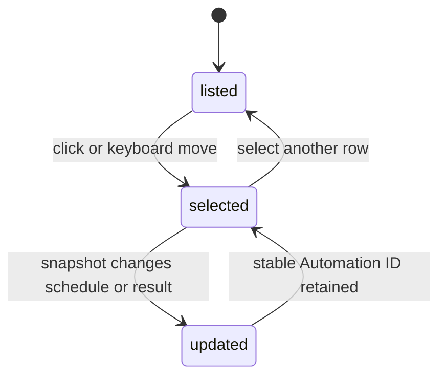

# Automation schedules and results

## Summary

The Automations section shows every safely reduced Automation, including disabled ones, independently of Nodes. Rows summarize name, state, and relative timing; selecting one expands schedule kind, full status, and absolute next and last run times. Clawbar cannot operate an Automation.

## The simple case

A healthy scheduled Automation shows its name and `Next 1h · Last 1h`; the repeated Healthy status is visually omitted. Selecting it expands `Scheduled · Healthy` and local next and last run times.

A failing enabled Automation uses critical color and `Failed`, with consecutive failures compacted as `Failed · 3×` when greater than one. Detail says `Automation Failure · 3 consecutive failures`.

## The action, event by event

### Ready

The section is always headed `AUTOMATIONS` in normal operational layout. Available empty data says `No Automations`; unavailable data says `Unavailable`, with a special message above 500 items.

### Invoked

Click or keyboard movement selects an Automation. Enter does not run, retry, cancel, enable, disable, edit, or delete it.

### Waiting begins

Selection settles immediately. Schedule and result changes arrive on a later Snapshot.

### While waiting

The row remains navigable. Relative next and last times recalculate each second from loaded timestamps, even without collection.

### Settled

Detail names kind as Scheduled, Repeating, One-time, Event-driven, or Unknown and presents full state. Disabled, Skipped, No runs yet, Waiting for event, Completed, Healthy, and Automation Failure remain distinct.

## Variants

| Variant | At invocation | If it changes while waiting |
| --- | --- | --- |
| Input method | Pointer selects exactly; keyboard moves in shared order. | Both retain by hidden Automation ID. |
| Panel visibility | Detail needs an open panel. | Closing does not alter scheduling. |
| Snapshot freshness | Current rows show live result semantics; historical rows say Last known and reduce opacity. | Time labels continue aging; stale transition removes current Incident meaning. |
| Gateway state | Healthy or Degraded can show available current Automations; failed states may show Last Known items. | Unavailable or setup results replace the section. |

## Cancel and interrupt

| Event | Before waiting | While waiting |
| --- | --- | --- |
| Escape or closing the panel | Hides detail. | Automation continues under OpenClaw. |
| Starting another Clawbar Action | Selection can move; refresh observes later result. | No Automation command is issued. |
| A scheduled or manual refresh completing | Updates order, result, times, and Selection. | Same. |
| Omarchy Shell losing focus, restarting, or exiting | Stops panel input. | Does not change Automation schedule. |
| The snapshot changing, becoming stale, or becoming unreadable | Valid change rerenders; unreadable input preserves current memory. | Can turn current failure into historical context. |
| The plugin being disabled, updated, or removed | Removes observation and notification scheduling. | Does not disable the Automation. |
| Switching between pointer and keyboard input | No effect beyond Selection. | No effect. |
| Gateway resolution or reachability changing | Not direct Automation state. | Later Snapshot determines current or historical presentation. |

## Interactions with other systems

**Privacy boundary.** Payloads, delivery destinations, accounts, commands, and raw errors are discarded. Name, kind, enabled state, result, bounded failure count, and times remain.

**Collection and freshness.** Collection pages up to 500 Automations; 501 or a reported total above 500 makes the whole section unavailable.

**Selection and navigation.** Automations follow Agents. Hidden Automation ID retains Selection across status-based reorder.

**Notifications and Incidents.** Each enabled current Automation Failure contributes one Incident regardless of consecutive failure count. Disabled, Skipped, historical, removed, and unavailable items do not.

**Theme and accessibility.** Failure uses critical signal; disabled uses dotted muted signal; routine healthy labels can be visually omitted while accessible description retains state.

**Plugin lifecycle.** Disabling Clawbar ends monitoring, not the Automations themselves.

## Edge cases

- Current order places failures first, then never-run, skipped, successful, completed one-time, waiting event-driven, and disabled examples according to reduced sort rules.
- Disabled with a retained error result is Disabled, not Automation Failure.
- One-time success without next run is Completed.
- Event-driven with no result is Waiting for event.
- Missing all run timestamps says `No run timestamps` in detail when result is None.
- More than one consecutive failure changes detail but not Attention count.
- Removed or disabled failing Automation ends monitoring without a recovery notification.

## Open questions and verification

- Confirm row sorting across all accepted states in the running panel.
- Confirm elision of long names and large failure counts at narrow width.
- Confirm accessible description when a healthy status is visually omitted.
- Confirm whether silently ending monitoring for a removed or disabled failure is the intended notification policy.

Verified against Clawbar commit `f08496e`.
