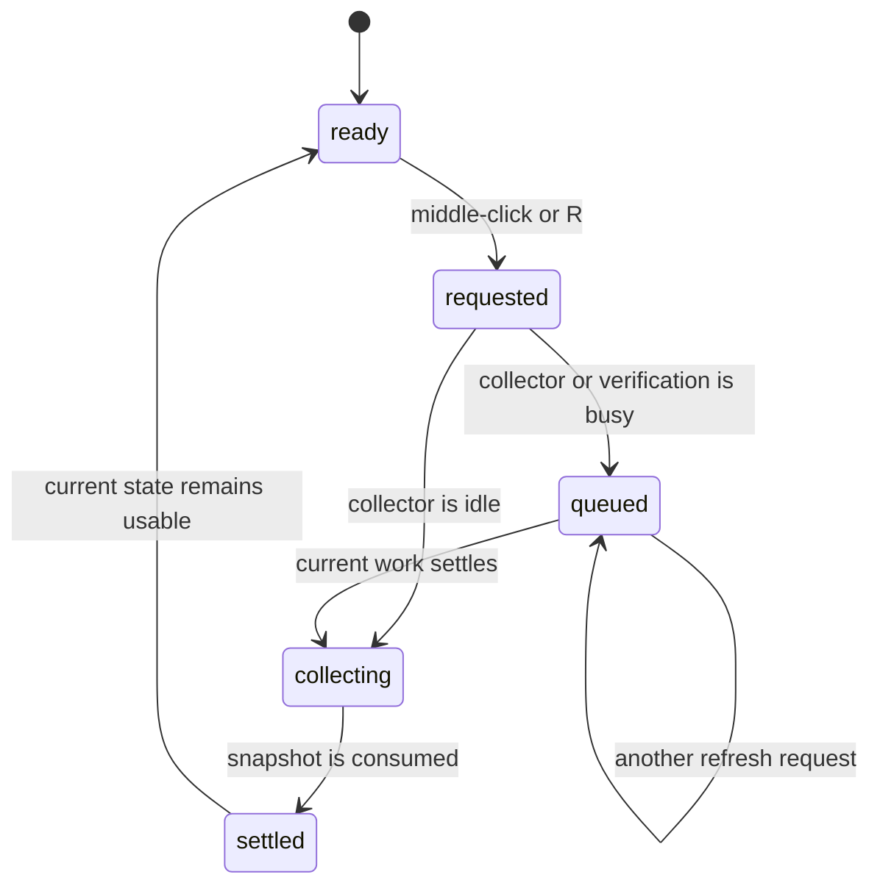

# Manual refresh

## Summary

Manual refresh asks Clawbar to collect a new snapshot without waiting for the next scheduled collection. The user can middle-click the bar widget whether the panel is open or closed, or press `r` or `R` while the panel has keyboard focus. The request does not block the bar or panel, and repeated requests while Clawbar is already busy are reduced to one later refresh.

Manual refresh is available in every visible Gateway state, including Gateway Setup Required, No data, Unstable, Offline, Configuration Error, and Stale. It does not bypass [Gateway resolution](../gateway/automatic-resolution.md), change the configured interval, or force a direct connection to a Node.

## The simple case

The user opens the panel and presses `r`. Clawbar starts one collection in the background. The user can continue moving the selection or close the panel while it runs.

If Clawbar has never loaded a usable snapshot, the bar and panel show Collecting until a result is consumed. If a snapshot is already visible, Clawbar keeps showing it while the panel summary and bar tooltip begin with `Refreshing…`; the bar Claw also animates. Scheduled collection remains quiet and does not show this user-action feedback.

When collection finishes, Clawbar reads the newly published snapshot. The panel updates to its new Gateway state, row contents, timestamps, Attention count, and severity. The selection is reconciled against the new rows rather than reset without reference to the prior selection.

## The action, event by event

### Ready

The Action is ready whenever the Clawbar service is loaded. The panel does not need to be open for a middle-click request. The keyboard form requires the open panel to own keyboard focus.

The request always uses the current accepted refresh interval when launching the collector. This affects the stale boundary written into the snapshot, but a manual request does not restart or postpone the repeating schedule.

The currently displayed snapshot, selection, and panel scroll position remain in place when the Action begins. Clawbar does not clear current rows in preparation for new data.

### Invoked

A middle-click on the bar widget requests collection instead of toggling the panel. A normal press still toggles the panel and does not request collection. While the panel has focus, `r` and `R` request collection; these keys do not become text input.

If the collector and candidate verifier are idle, the collector starts. If either is busy, Clawbar records that one refresh remains pending. The request itself produces no success notification and no durable user-created record.

When no collector service is available, the request cannot start. If Clawbar also has no snapshot, it changes to No data. If an existing snapshot is visible, it remains visible and the summary becomes `Refresh failed · showing last known` for six seconds. The shell console still receives the private-safe service warning.

### Waiting begins

On a first run with no usable snapshot, starting collection changes the visible state to Collecting. The bar summary becomes `Collecting OpenClaw Gateway status`; the Attention count is zero.

With an existing snapshot, the old rows and Gateway state remain displayed until a later snapshot replaces them or their own age crosses the stale boundary. The summary begins with `Refreshing…`, and the Claw animates, so the user can distinguish the in-flight Action without losing the last usable Operational Metadata.

The collection shares the same bounded path as a scheduled collection. It resolves one Gateway, reads bounded metadata, reduces it to Operational Metadata, and atomically publishes a snapshot. See [Collection and freshness](../foundations/collection-and-freshness.md).

### While waiting

The panel remains interactive. The user can move selection, inspect another row, or close the panel. Collection happens outside the rendering process and cannot make row navigation wait for Gateway commands.

A second or later manual refresh does not start another collector beside the first. All refresh requests received while collection or candidate verification is busy coalesce into one pending refresh. The same applies when the repeating schedule fires while work is already running.

Candidate verification and ordinary collection never run at the same time. If verification is already running, a manual refresh waits. If a verification request is made while collection is running, verification takes precedence when the current collection settles; the pending refresh runs after verification.

The current snapshot can become Stale while the request is still running. Freshness is evaluated once per second from the timestamp already in memory, so a visible healthy or failed state may change to Stale before the new collection result arrives.

### Settled

When the collector exits, Clawbar requests a snapshot read. A valid published snapshot replaces the in-memory snapshot and determines the Gateway state, rows, severity, summary, timestamps, and Attention count.

If the new snapshot changes row order, selection follows the same stable key. If that row disappeared, selection moves to a surviving row near the old index. The prior inline detail collapses and the reconciled operational row expands its own detail. See [Selection model](../foundations/selection-model.md).

If the refresh was queued, one new collection starts after the current work has fully stopped. Ten requests while busy therefore produce at most one additional collection, not ten. User-action feedback remains active across the wait and settles only when that interactive collection finishes.

A collection result may settle into Healthy, Degraded, Gateway Setup Required, Unstable, Offline, Configuration Error, No data, or another snapshot-derived state. “Settled” means the result was consumed; it does not mean the Gateway is healthy.

If the interactive collector exits unsuccessfully, Clawbar preserves any prior snapshot and shows `Refresh failed · showing last known` for six seconds. If reading or parsing the snapshot fails and Clawbar has no prior snapshot, the state becomes No data after a collection attempt. A prior snapshot is never discarded by the failed read.

## Variants

| Variant | At invocation | If it changes while waiting |
| --- | --- | --- |
| Input method | Middle-click works from the bar with the panel open or closed. `r` and `R` work only through the focused panel. | Switching input method does not change the request. Pointer and keyboard navigation remain available while collection runs. |
| Panel visibility | An open panel permits `r`; middle-click does not require it. Starting refresh does not open or close the panel. | Closing the panel leaves collection running. Reopening shows the current in-memory state and later receives the result. |
| Snapshot freshness | With no snapshot, the Action shows Collecting. With a usable snapshot, it remains visible beneath `Refreshing…`. | The old snapshot may cross its stale boundary before collection settles. The next valid snapshot replaces that stale presentation. |
| Gateway state | Every Gateway state accepts a refresh. The current state determines what remains visible while the request runs. | Resolution or reachability changes are reflected only in the resulting snapshot; they do not mutate the current rows during collection. |

The collector reads the environment and current target state when the process starts. Changes after that point are not documented as live changes to the already running request.

## Cancel and interrupt

| Event | Before waiting | While waiting |
| --- | --- | --- |
| Escape or closing the panel | Closing prevents the panel keyboard shortcut but does not affect a middle-click request. | The panel closes; collection continues and may update the snapshot while hidden. |
| Starting another Clawbar Action | Selection and panel toggling act normally. Candidate verification starts immediately only if no collection has started. | Selection and panel toggling act immediately. Refresh coalesces; candidate verification waits and is handled before a pending refresh. |
| A scheduled or manual refresh completing | A completion from earlier work can update the snapshot before this request starts. | Completion settles the current collection. If another refresh is pending, one more collection starts. |
| Omarchy Shell losing focus, restarting, or exiting | Focus loss removes the panel shortcut until focus returns; the bar pointer route depends on the shell remaining present. | Focus loss alone is not specified to cancel collection. Restart or exit unloads the service; an external collector already running remains bounded by its deadline. |
| The snapshot changing, becoming stale, or becoming unreadable | A newly consumed snapshot changes the state from which the request begins. | Replacement settles the visible result. Staleness may appear before completion. An unreadable result preserves an existing in-memory snapshot but yields No data when none exists. |
| The plugin being disabled, updated, or removed | The collection service becomes unavailable, so no new request can start. | Future scheduling stops immediately. A collector already inside its bounded request can continue until its deadline. |
| Switching between pointer and keyboard input | Either available input route starts the same Action. | The switch has no effect on the running collection; both routes share the same panel and selection state. |
| Gateway resolution or reachability changing | The new condition is observed by the process that starts next. | The running process settles according to what it observes before its deadline; Clawbar does not probe Nodes as an alternative. |

Manual refresh has no explicit cancel command. Closing the panel cancels only the view, not the work. A later refresh request adds one pending run rather than cancelling or restarting the current run.

> Technical note: QML serializes the collector and candidate-verifier processes. This is why repeated requests cannot create overlapping collectors and why candidate verification can run before an already pending refresh.

## Interactions with other systems

**Privacy boundary.** Manual refresh uses the same reduction as scheduled collection. It does not make raw Gateway output, credentials, Private Content, host identifiers, or raw errors visible merely because the user requested it directly.

**Collection and freshness.** The Action does not have a special deadline or stale policy. It uses the configured interval, the shared 12-second whole-collection deadline, atomic snapshot publication, and the three-interval stale boundary.

**Selection and navigation.** Navigation remains responsive during collection. Snapshot replacement reconciles the one selection by stable key and nearby index; refresh itself does not reset selection.

**Notifications and Incidents.** Manual and scheduled collection use the same Incident transition rules. A newly observed Incident or recovery may notify once for its continuous period. The manual origin does not add a second notification.

**Theme and accessibility.** The Action has a keyboard route (`r` or `R`) and a pointer route (middle-click). The visible Collecting, result, and severity presentations use theme colors and text labels rather than color alone in the panel and tooltip.

**Plugin lifecycle.** Enabling the plugin already causes an immediate scheduled collection, so a manual refresh at startup may coalesce with it. Disabling or removing the plugin stops future work but does not promise to kill a collector already within its 12-second bound.

## Edge cases

- Repeated `r` key presses while idle start one collection; later presses received while it is running collapse into one additional collection.
- A scheduled timer firing and several manual requests during one collection still leave only one pending refresh.
- A pending candidate verification runs before a pending refresh after the current collection stops.
- If several candidate requests arrive while busy, only the latest pending candidate remains; the refresh still remains a single pending request.
- A first collection can fail with no earlier success. The visible result is No data, not Unstable Gateway.
- A previously successful Gateway can fail once and settle as Unstable, then fail again on the queued refresh and settle as Offline.
- A healthy old snapshot can become Stale while a slow manual request remains within the collection deadline.
- An invalid or unreadable snapshot does not erase an already loaded snapshot from memory.
- Middle-click requests refresh without opening the panel. A normal click opens or closes the panel without refreshing.
- The refresh shortcut is case-insensitive for `r` and `R`.
- A scheduled refresh never shows `Refreshing…`; only `r` and middle-click produce user-action feedback.

## Open questions and verification

- Confirm in the running Omarchy panel that `r` remains responsive and selection movement stays immediate during a deliberately delayed collection.
- Confirm whether keyboard auto-repeat on `r` has any visible effect beyond the documented single pending refresh.
- Confirm that closing and reopening the panel during collection preserves the expected focus and selection.
- Confirm shell focus-loss behavior; the source establishes process serialization but not every compositor-level focus transition.
- Confirm that `Refreshing…` remains visible across a manual request queued behind scheduled collection or candidate verification.
- Confirm that the six-second failure message is long enough to notice without obscuring Last Known Metadata for too long.

Verified against Clawbar commit `f08496e`.
