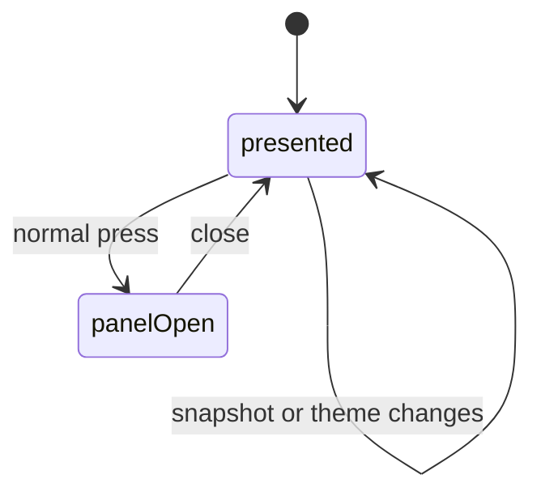

# Bar signal and tooltip

## Summary

The bar widget compresses Clawbar state into a colored, right-facing claw mark and tooltip. It does not show a separate dot or numeric badge. The mark copies the two-path claw used beside elapsed time in OpenClaw chat, uses healthy, warning, or critical color, and the tooltip names the Gateway condition and appends the current Attention count when severity is not healthy.

## The simple case

With a current healthy local Gateway and no Attention Item, the claw uses the theme's green and the tooltip says `Local OpenClaw Gateway healthy`. Opening the panel reveals the fuller status.

The closed-bar tooltip retains the Attention Item count. In the open panel, when the header already shows a numeric Incident label such as `2 Incidents`, the Gateway summary omits the duplicate Attention Item count and states only Gateway health and resolution source. Other warning and critical presentations keep the Attention Item count when the header does not show that number.

An enabled Automation Failure makes the claw critical even while Gateway reachability remains healthy. A warning state such as Degraded or Stale uses the theme's yellow.

## The action, event by event

### Ready

The widget derives signal from the current in-memory Snapshot and presentation state. Before data exists, Starting, Collecting, No data, Setup Required, and Unavailable are warning states.

### Invoked

A normal press toggles the panel; middle-click requests [manual refresh](manual-refresh.md). Hovering starts a restrained flex-and-snap microinteraction. The signal itself is not a separate control.

### Waiting begins

Panel toggling settles immediately. A refresh may wait, but an existing signal remains visible without a busy overlay. While any collection runs, the same flex-and-snap motion gives activity feedback; a user-requested refresh also prefixes the tooltip and panel summary with `Refreshing…` while scheduled collection stays quiet.

### While waiting

Freshness continues to update. The mark can become Stale while collection runs, and theme-file reload can change healthy or warning color without changing state.

### Settled

A consumed Snapshot recalculates severity, count, summary, and color. In Developer demonstration mode, the tooltip prefixes the normal summary with `Developer demo ·`.

## Variants

| Variant | At invocation | If it changes while waiting |
| --- | --- | --- |
| Input method | Pointer opens the panel or middle-clicks refresh; the tooltip is hover-driven by the shell. | No effect on signal semantics. |
| Panel visibility | The same signal remains in the bar while the panel is open. | Closing does not change it. |
| Snapshot freshness | Current state supplies normal severity; historical Stale is warning with one Attention Item. | Age can change the signal before collection settles. |
| Gateway state | Offline and Configuration Error are critical; Degraded, Unstable, Setup Required, No data, and Stale are warning. | The next presentation replaces color and tooltip atomically. |

## Cancel and interrupt

| Event | Before waiting | While waiting |
| --- | --- | --- |
| Escape or closing the panel | No effect on the bar signal. | The signal remains visible. |
| Starting another Clawbar Action | Normal and middle press route to panel or refresh. | Signal continues to reflect current state. |
| A scheduled or manual refresh completing | Recomputes signal. | Replaces it with the new result. |
| Omarchy Shell losing focus, restarting, or exiting | Focus does not change severity. | Exit removes the widget; restart rereads state and theme. |
| The snapshot changing, becoming stale, or becoming unreadable | Valid state changes the signal. | Unreadable input preserves an existing signal; age can make it Stale. |
| The plugin being disabled, updated, or removed | Removes the widget. | No signal exists after unload. |
| Switching between pointer and keyboard input | No effect on presentation. | No effect. |
| Gateway resolution or reachability changing | Not visible until collected. | The resulting Snapshot changes the signal. |

## Interactions with other systems

**Privacy boundary.** Tooltip summaries name resolution class and generalized state, never endpoint, credential, raw error, or Private Content.

**Collection and freshness.** [Collection and freshness](../foundations/collection-and-freshness.md) owns state timing. The bar reflects it without blocking.

**Selection and navigation.** Selection does not alter the bar.

**Notifications and Incidents.** Current Incident severity rolls up to critical; count is spoken in tooltip text but is not drawn as a badge.

**Theme and accessibility.** Green and yellow come from the active Omarchy theme when available; critical uses the shell urgent color. Tooltip text prevents color from being the only summary. Motion carries no status information: the claw keeps its readable resting pose whenever the animation is not running.

**Plugin lifecycle.** Enable creates one widget instance in the right section by default; disable or removal removes it.

## Edge cases

- A healthy Snapshot can have a nonzero working-Agent count while severity remains healthy; that count is not appended as an Attention Item.
- One critical Automation shows `1 Attention Item` in the tooltip; several use plural wording.
- Stale overrides an old critical state and displays warning severity with one current Attention Item.
- Missing theme green or yellow falls back to shell foreground or accent colors.
- The right-facing claw occupies the standard status slot and points toward the surrounding status content.

## Open questions and verification

- Confirm tooltip accessibility and hover timing in the actual shell.
- Confirm contrast on all release-review themes and whether fallback colors remain distinguishable.
- Confirm whether showing no visible numeric badge is sufficiently clear for multiple Incidents.

Verified against Clawbar commit `f08496e`.
