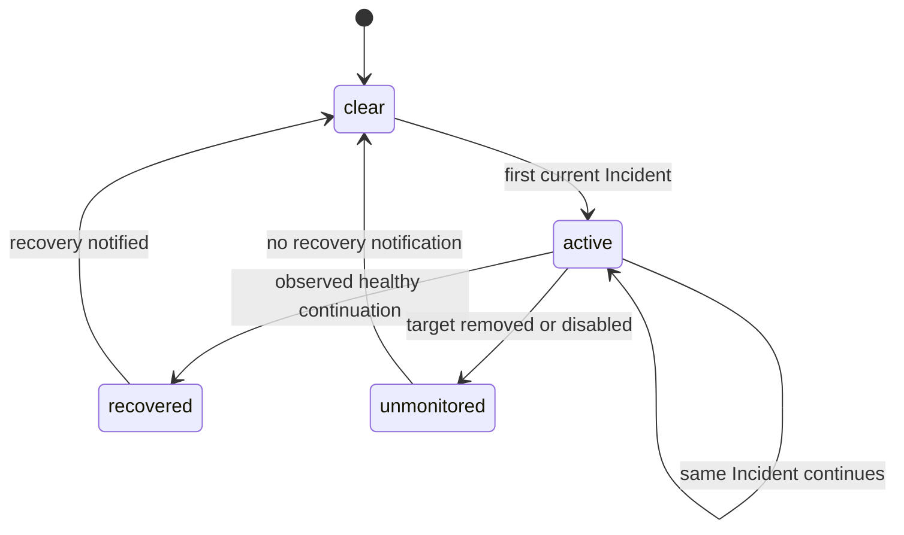

# Incidents and notifications

## Summary

Clawbar distinguishes visible Attention Items from notification-producing Incidents. Offline Gateway, Configuration Error, and enabled Automation Failure form continuous Incident periods. Starts use critical desktop notifications; genuine recoveries use normal urgency. Changes observed in one collection are grouped.

## The simple case

A healthy Automation starts failing. The next successful collection makes its row critical, increments the bar Attention count once, and sends `Incident detected` with a Clawbar incident icon and `{Automation name}: Automation Failure`.

Further failing collections stay quiet. When the same enabled Automation later reports a non-error result, Clawbar sends one recovery notification and removes that Incident.

## The action, event by event

### Ready

Per-login Incident state records currently monitored Gateway and Automation incident keys. No previous state means a current Incident can notify again after a new desktop login.

### Invoked

Each published Snapshot is reconciled against that state after collection. Offline Gateway, Configuration Error, and enabled Automation error start or continue Incidents.

### Waiting begins

Notification dispatch is bounded to 0.25 seconds and does not become panel work. Failure to launch or complete `notify-send` does not block Snapshot publication.

### While waiting

Simultaneous starts or recoveries are grouped. The body includes at most three `label: state` details, followed by `+N more` when needed.

### Settled

Starts use critical urgency and the two-path claw shown beside elapsed time in OpenClaw chat, with a red warning badge at its lower-left edge. Their concise title says `Incident detected`, or `{N} incidents detected` when grouped. Recoveries use normal urgency and the same mark with a green completion badge; their title says `Incident resolved` or `{N} incidents resolved`. Placing the badge opposite the claw tip keeps the mark's rightward direction readable toward the notification text. The notification app name remains `Clawbar`, while the visible title omits the redundant `Clawbar:` prefix. A removed or disabled Automation ends monitoring silently rather than claiming recovery. Gateway Setup Required also drops Gateway monitoring without recovery.

## Variants

| Variant | At invocation | If it changes while waiting |
| --- | --- | --- |
| Input method | Scheduled and manual collection share transition rules. | No effect. |
| Panel visibility | Notifications occur whether the panel is open or closed. | Closing does not acknowledge them. |
| Snapshot freshness | Current observed Incidents count; Last Known and Stale do not reassert old ones. | Stale presentation does not itself dispatch recovery through the collector. |
| Gateway state | Offline and Configuration Error notify; Healthy or Degraded can recover Gateway Incident; Setup Required ends monitoring silently. | Settled Snapshot determines transition. |

## Cancel and interrupt

| Event | Before waiting | While waiting |
| --- | --- | --- |
| Escape or closing the panel | No acknowledgement or cancellation. | Notification dispatch continues independently. |
| Starting another Clawbar Action | Refresh can observe a transition sooner. | Duplicate current Incident remains deduplicated. |
| A scheduled or manual refresh completing | Reconciles transitions. | Groups all changes in that Snapshot. |
| Omarchy Shell losing focus, restarting, or exiting | Focus has no effect. | A new login can notify current Incidents again because state is per-login. |
| The snapshot changing, becoming stale, or becoming unreadable | Only collector-processed valid state drives persisted transitions. | Unreadable UI input does not create a notification. |
| The plugin being disabled, updated, or removed | Ends future monitoring. | Existing OpenClaw Incident conditions continue outside Clawbar. |
| Switching between pointer and keyboard input | No effect. | No effect. |
| Gateway resolution or reachability changing | Collected Offline or Configuration Error can start an Incident. | Setup Required is non-Incident; successful current state can recover. |

## Interactions with other systems

**Privacy boundary.** Notifications contain only Gateway or bounded Automation label and generalized state, never raw errors or endpoints.

**Collection and freshness.** Transition state is reconciled per completed collector. Unstable, Degraded, and Stale are Attention Items but not notification Incident kinds.

**Selection and navigation.** Selecting a failed row does not acknowledge, recover, or suppress notifications.

**Notifications and Incidents.** This document owns start, continuation, grouping, recovery, silent unmonitoring, urgency, detail limit, and per-login deduplication.

**Theme and accessibility.** Notification icons are self-contained plugin assets rather than theme icon names, so their source and state remain recognizable across icon themes and notification history. The visible title and body still carry explicit state text; panel and bar retain explicit state if notifications are unavailable.

**Plugin lifecycle.** Incident state is under `XDG_RUNTIME_DIR`, so a new login can notify an already current Incident once again. Disable/removal stops later reconciliation.

## Edge cases

- First Gateway failure is Unstable and quiet; second becomes Offline and starts the Incident.
- Offline Nodes never start Incidents; legacy Node incident entries are purged without recovery.
- Several failing Automations produce one grouped notification, not one notification per item.
- More than three simultaneous changes summarize the remainder.
- Removed or disabled failing Automation ends monitoring without recovery.
- Notification command failure preserves Snapshot and transition state and is not retried as a duplicate start.
- Gateway Setup Required is yellow but quiet.

## Open questions and verification

- Confirm desktop notification appearance, grouping, and truncation under the supported notification daemon.
- Confirm whether silent unmonitoring on Automation removal/disable and Gateway Setup Required is the desired product policy.
- Confirm what users expect when notification dispatch fails silently.

Verified against Clawbar commit `f08496e`.
