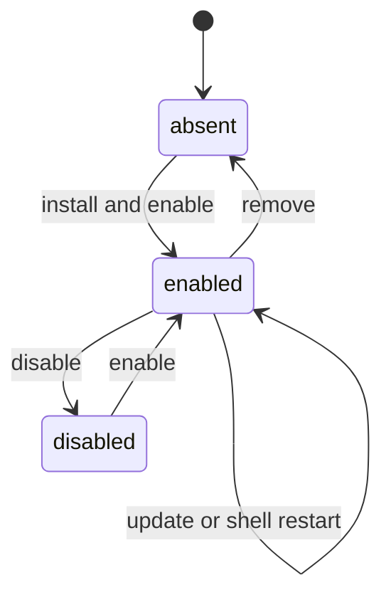

# Plugin lifecycle

## Summary

Clawbar installs as one non-repeatable bar widget and one service. Enabling it places the widget in the right bar section by default and starts immediate bounded collection plus the repeating schedule. Updating reloads product files through Omarchy. Disabling or removing unloads scheduling without changing OpenClaw work or leaving a daemon or systemd unit.

## The simple case

The user installs and enables the plugin. The claw appears in the right bar section and collection starts immediately, then repeats every 30 seconds by default.

The user disables or removes Clawbar. The widget, panel, service timer, and future notifications disappear. A collector already running exits within the shared 12-second deadline.

## The action, event by event

### Ready

Requirements are Omarchy with plugin commands, supported OpenClaw command surfaces, and Python 3. Tailscale is optional and used only for verified fallback setup.

### Invoked

`omarchy plugin add … --enable` installs and enables. Update, disable, and remove use the plugin ID `io.github.yasuhito.clawbar`. Clawbar itself provides no in-panel lifecycle controls.

### Waiting begins

Enable loads the service and triggers collection at once. Update or restart may briefly remove and recreate UI. Disable and remove unload future scheduling immediately.

### While waiting

An external collector already inside its bounded request is not promised immediate termination. No new overlapping collector is started by the replacement service.

### Settled

Enabled state has one widget because multiple instances are disallowed. Disabled or removed state has no widget, panel, service timer, or Clawbar notification scheduling. No installed Python package, daemon, systemd service, or timer remains.

## Variants

| Variant | At invocation | If it changes while waiting |
| --- | --- | --- |
| Input method | Lifecycle uses Omarchy plugin commands, not panel Actions. | Panel input disappears on unload. |
| Panel visibility | An open panel disappears when plugin unloads. | Re-enable recreates it closed unless shell restoration differs. |
| Snapshot freshness | Persisted Snapshot can seed reloaded presentation, then immediate collection updates it. | It may become Stale before or during reload. |
| Gateway state | Lifecycle does not alter Gateway state. | Re-enabled collector observes current state afresh. |

## Cancel and interrupt

| Event | Before waiting | While waiting |
| --- | --- | --- |
| Escape or closing the panel | No effect on enablement. | Cannot cancel plugin command or running collector. |
| Starting another Clawbar Action | Available only while enabled. | Unload removes the surface; external collector remains bounded. |
| A scheduled or manual refresh completing | Can update state before lifecycle change. | A late collector may publish state after UI unload; later reload can read it. |
| Omarchy Shell losing focus, restarting, or exiting | Focus has no lifecycle effect. | Restart unloads and recreates entries; exit stops service timer. |
| The snapshot changing, becoming stale, or becoming unreadable | Does not enable or disable plugin. | Re-enabled UI applies normal read rules. |
| The plugin being disabled, updated, or removed | This is the lifecycle Action itself. | Settles by unloading or replacing widget and service. |
| Switching between pointer and keyboard input | No effect on plugin commands. | No effect. |
| Gateway resolution or reachability changing | Does not block installation. | Immediate collection after enable observes it. |

## Interactions with other systems

**Privacy boundary.** Lifecycle does not grant Clawbar control of OpenClaw or credentials. Persisted operational and private target state cleanup on removal is not explicitly promised.

**Collection and freshness.** Enable triggers immediate collection and repeating schedule. Disable/remove stops future requests; in-flight work remains bounded.

**Selection and navigation.** Plugin reload recreates panel-local Selection and focus; persistence is not promised.

**Notifications and Incidents.** Disable/remove stops future reconciliation. Per-login Incident state may remain until login ends; re-enable behavior should be observed.

**Theme and accessibility.** Reload recreates the widget under current theme and accessibility tree.

**Plugin lifecycle.** This document owns install, enable, update, disable, remove, and shell-process lifetime behavior.

## Edge cases

- `allowMultiple` is false, so adding Clawbar does not intentionally create several widget/service pairs.
- A manual refresh issued just before disable can leave one external collector running for up to its deadline.
- Disabling does not disable OpenClaw Automations or disconnect Nodes.
- Removing leaves no daemon or systemd unit because none was installed.
- Tailscale absence does not prevent plugin enable; it changes only fallback setup guidance.
- Custom refresh environment is read when the shell starts, so changing it without restart does not update the service.

## Open questions and verification

- Confirm update and shell-restart visual sequencing, late collector publication, and duplicate-process avoidance.
- Confirm whether remove retains or deletes Snapshot, verified fallback, candidate mapping, and runtime secrets; user-facing cleanup expectations need a product decision.
- Confirm re-enable notification behavior within the same desktop login.

Verified against Clawbar commit `f08496e`.
