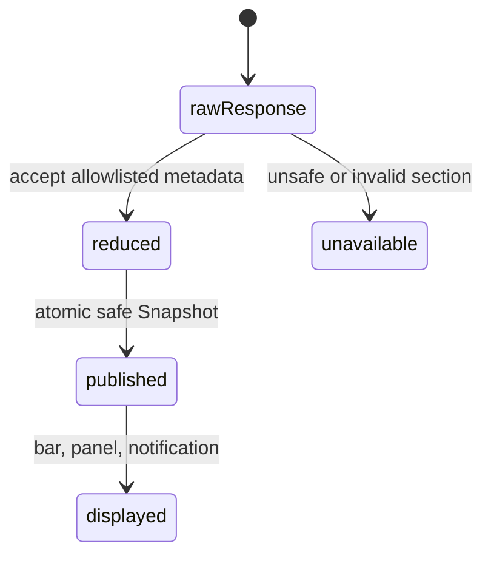

# Privacy boundary

## Summary

Clawbar persists and displays only bounded Operational Metadata needed to explain Fleet health. Private Content is rejected during reduction, before public Snapshot publication. The boundary applies equally to automatic collection, manual refresh, fallback setup, notifications, developer fixtures, rows, and detail.

## The simple case

Clawbar asks the Gateway for structured status, then publishes generalized state, bounded names and runtime labels, schedule metadata, timestamps, and opaque UI keys. The panel can explain health without showing task instructions, messages, destinations, accounts, credentials, private endpoints or identifiers, or raw errors.

Private target mappings and key material needed for fallback and stable identity remain private per-user or per-login state and do not enter the Snapshot.

## The action, event by event

### Ready

Collection may receive Private Content because the upstream response contains more than Clawbar needs. No raw response is treated as display data.

### Invoked

Scheduled refresh, manual refresh, or candidate verification uses the same reduction boundary.

### Waiting begins

Data is parsed and bounded before publication. Private text in stdout or stderr never becomes status merely because it resembles an error.

### While waiting

Invalid identity, duplicate unsafe IDs, unsupported shape, or excess count can make a section unavailable rather than weakening the boundary.

### Settled

Only a reduced Snapshot reaches QML. Notifications use generalized labels and state. Raw command output is discarded after parsing.

## Variants

| Variant | At invocation | If it changes while waiting |
| --- | --- | --- |
| Input method | Manual and scheduled origin share one boundary. | No effect. |
| Panel visibility | Hidden and visible collection publish the same safe shape. | Opening cannot reveal discarded data. |
| Snapshot freshness | Current and Last Known Metadata use the same allowed fields. | Historical treatment does not restore Private Content. |
| Gateway state | Every success, failure, setup, and configuration state uses private-safe wording. | Raw transition cause remains excluded. |

## Cancel and interrupt

| Event | Before waiting | While waiting |
| --- | --- | --- |
| Escape or closing the panel | Hides allowed data; does not change persisted boundary. | Reduction continues. |
| Starting another Clawbar Action | Every Action reuses the boundary. | Serialization prevents unsafe partial publication. |
| A scheduled or manual refresh completing | Publishes only reduced data. | Atomic replacement exposes no partial raw state. |
| Omarchy Shell losing focus, restarting, or exiting | No effect on allowed fields. | Per-login secrets and Incident state follow runtime lifetime. |
| The snapshot changing, becoming stale, or becoming unreadable | A valid Snapshot remains bounded. | Unreadable data is rejected rather than displayed. |
| The plugin being disabled, updated, or removed | Stops future collection. | Does not send Private Content elsewhere. |
| Switching between pointer and keyboard input | No effect. | No effect. |
| Gateway resolution or reachability changing | Only generalized outcome is public. | Endpoint and raw errors remain private. |

## Interactions with other systems

**Privacy boundary.** This document owns it. Operational Metadata is an allowlist, not a promise to sanitize arbitrary extra fields after publication.

**Collection and freshness.** Last Known Metadata copies only previously reduced sections. Failed current sections do not carry forward hidden raw values.

**Selection and navigation.** UI keys support selection but are opaque and not displayed. Unsafe keys make data unavailable.

**Notifications and Incidents.** Notification labels contain Gateway or bounded Automation names and generalized states, at most three details plus a remainder count.

**Theme and accessibility.** Accessible names and descriptions must use the same bounded presentation fields as visible text.

**Plugin lifecycle.** Snapshot and verified fallback are per-user state; local key secret and Incident deduplication are per-login runtime state. Removal instructions do not claim to erase OpenClaw data because Clawbar never owns it.

## Edge cases

- Gateway URLs containing embedded credentials are not persisted.
- Tailscale and Node private identifiers become opaque HMAC-derived keys; the private value and secret never enter the Snapshot.
- Missing or invalid key material makes metadata unavailable instead of using positional identity.
- Raw stderr text such as token or connection messages cannot override structured result.
- Automation payload, destination, delivery error, and account fields are discarded.
- Snapshot, candidate, target, secret, and Incident state paths use private directory or file modes where they contain private state.

## Open questions and verification

- Audit actual accessibility trees and desktop notification history for excluded values.
- Confirm plugin removal expectations for retained Snapshot and private fallback files; current user documentation emphasizes process removal more than data cleanup.
- Confirm file modes on a real Omarchy login with custom XDG paths.

Verified against Clawbar commit `f08496e`.
