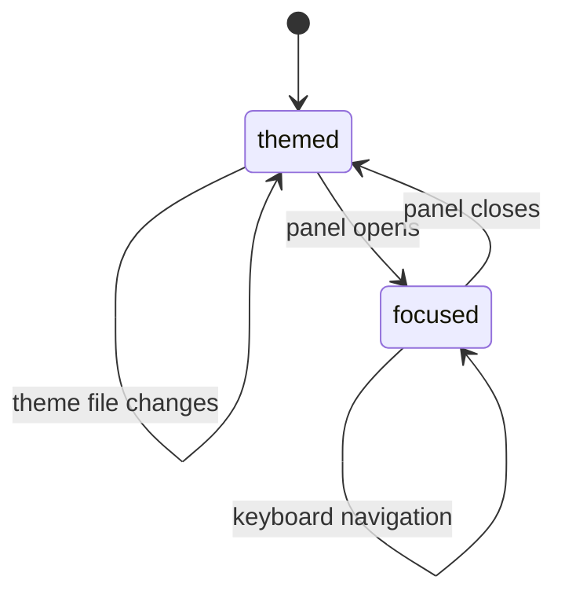

# Theme and accessibility

## Summary

Clawbar follows Omarchy Shell typography, spacing, popup sizing, selected fill, foreground, accent, urgent, and muted colors. It supplements color with signal shape, state text, tooltip summaries, historical labels, timestamps, keyboard navigation, and selected borders.

## The simple case

The bar uses a theme green for Healthy, theme yellow for warning, and shell urgent color for critical. The panel header repeats Gateway status with a signal and label. Rows use filled circles for current active states, a dotted ring for disabled Automation, and a quiet muted outline ring for Idle Agent.

The user opens the panel, navigates with arrows or `j`/`k`, activates a candidate with Enter, refreshes with `r`, and closes with Escape.

## The action, event by event

### Ready

The widget reads shell colors and the active theme's `colors.toml`. Panel size fits content up to its maximum height and scrolls when needed.

### Invoked

Opening directs focus to the panel key catcher. Keyboard and pointer Actions share Selection.

### Waiting begins

No accessibility Action requires Gateway response. Theme reload and Snapshot changes can update presentation while input remains responsive.

### While waiting

Selected rows remain identified by fill and border. Historical rows use reduced opacity plus text. Long names and statuses elide within bounded row widths; detail text wraps.

### Settled

A theme generation change reloads green and yellow aliases; missing values use safe shell fallbacks. Text labels continue to carry semantics if colors change.

## Variants

| Variant | At invocation | If it changes while waiting |
| --- | --- | --- |
| Input method | Keyboard covers panel navigation and actions; pointer covers exact selection and bar press. | Both share Selection and visible state. |
| Panel visibility | Closed surface relies on claw color and tooltip; open panel provides labels and detail. | Closing removes keyboard surface but leaves tooltip signal. |
| Snapshot freshness | Historical state uses text, age, and opacity. | Stale transition updates all cues. |
| Gateway state | Each state maps to explicit label and semantic tone. | Snapshot replacement changes label and color together. |

## Cancel and interrupt

| Event | Before waiting | While waiting |
| --- | --- | --- |
| Escape or closing the panel | Provides keyboard dismissal. | Focus return and inherited animation require observation. |
| Starting another Clawbar Action | Keyboard shortcuts remain direct. | Refresh and verification should not freeze navigation. |
| A scheduled or manual refresh completing | Updates accessible and visible state. | Dynamic announcement behavior requires verification. |
| Omarchy Shell losing focus, restarting, or exiting | Focus behavior belongs partly to the shell. | Reload restores theme and current Snapshot. |
| The snapshot changing, becoming stale, or becoming unreadable | Text and color update for valid state. | Existing presentation remains on unreadable input. |
| The plugin being disabled, updated, or removed | Removes widget and panel from accessibility tree. | No Clawbar focus remains after unload. |
| Switching between pointer and keyboard input | Shared Selection prevents divergent state. | Focus indication may differ and needs observation. |
| Gateway resolution or reachability changing | No direct visual change until Snapshot. | Result updates all state cues. |

## Interactions with other systems

**Privacy boundary.** Accessible descriptions must not reveal hidden IDs or Private Content.

**Collection and freshness.** Navigation remains immediate during the external collector; dynamic state comes from complete Snapshots.

**Selection and navigation.** [Selection model](../foundations/selection-model.md) owns wrap and scroll. Selected border and fill expose current location visually.

**Notifications and Incidents.** Desktop notifications supplement but do not replace persistent panel and tooltip state.

**Theme and accessibility.** This document owns the shared visual and input rules. Node and Automation rows have explicit accessible names and descriptions, including the state hidden from a routine healthy summary; Agent and candidate behavior still needs hand inspection.

**Plugin lifecycle.** Theme reload occurs with shell theme generation; plugin reload recreates focus and local Selection.

## Edge cases

- Healthy and warning theme aliases can fall back to foreground and accent if absent.
- Disabled Automation uses a dotted ring; Idle Agent uses a muted outline ring and omits the repeated visible `Idle` row label.
- Healthy routine Node and Automation labels may be visually omitted while exceptional and historical labels stay explicit.
- Narrow panel rows elide names and status; detail wraps.
- The developer demonstration prefix prevents fictional state from appearing current.
- Reduced-motion behavior is inherited and not explicit in Clawbar source.

## Open questions and verification

- Inspect the accessibility tree for every row kind, selected state, hidden healthy label, and dynamic detail.
- Verify contrast on white, catppuccin-latte, flexoki-light, and vantablack themes.
- Verify narrow and wide panels, keyboard-only use, focus return, and reduced motion.
- Visually omitted healthy Node and Automation labels have explicit accessible descriptions in source; confirm the shell exposes them, and inspect Agent/candidate semantics separately.

Verified against Clawbar commit `f08496e`.
