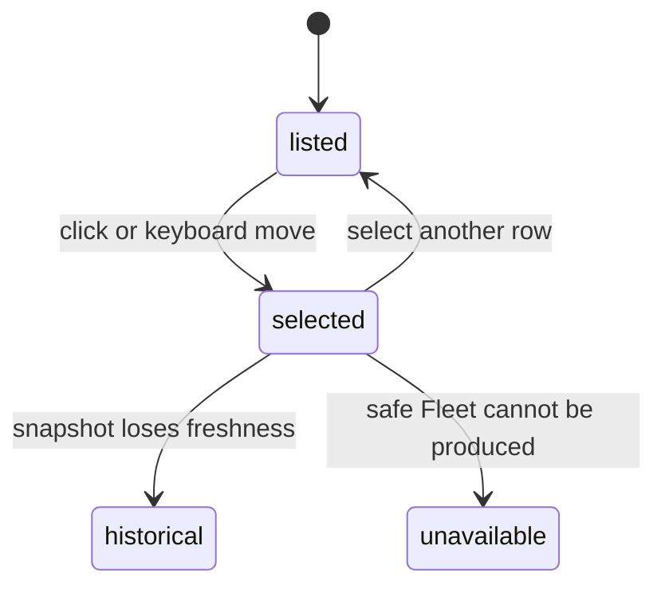

# Nodes

## Summary

The Fleet section shows one row per safe, deduplicated Node reported by the Gateway. Each row presents name and state; selecting it expands bounded platform, model, version, last-seen, and observation metadata. Clawbar never probes a Node or offers Node controls.

## The simple case

A current connected Node appears with a healthy signal and bold name. Its routine `Healthy` text is visually omitted. The user selects it and reads available platform, model, version, last-seen time, and collection observation time below the row.

An Offline Node is muted and explicitly labeled Offline. It does not affect the Gateway, bar Attention count, Incident state, or notifications.

## The action, event by event

### Ready

Fleet metadata is available and contains reduced Nodes with safe Node UI Keys. Gateway order determines row order after same-name registrations are collapsed.

### Invoked

Pointer click or keyboard movement selects a Node. No activation command is sent; Enter has no Node behavior.

### Waiting begins

Selection settles immediately. Refresh and freshness may later replace or reclassify the row, but detail uses already loaded metadata.

### While waiting

The user can navigate during collection. Selection follows the Node UI Key across reorder and replacement registration.

### Settled

The selected row expands Node detail. Missing platform/model/version becomes `No additional Operational Metadata`; missing last-seen time becomes `No observation timestamp`. Historical rows add Last known age and reduced opacity.

## Variants

| Variant | At invocation | If it changes while waiting |
| --- | --- | --- |
| Input method | Pointer selects exactly; keyboard enters the row through shared order. | Same Node UI Key remains selected. |
| Panel visibility | Selection requires the open panel. | Closing does not control the Node or collector. |
| Snapshot freshness | Current rows show current state; historical rows say Last known. | Freshness changes emphasis and time, not private identity. |
| Gateway state | Healthy or Degraded can show current Fleet when available; failed and Stale states can show Last Known Fleet. | Setup, no-data, or unavailable results can remove rows. |

## Cancel and interrupt

| Event | Before waiting | While waiting |
| --- | --- | --- |
| Escape or closing the panel | Hides Node detail. | Does not change Node state. |
| Starting another Clawbar Action | Selecting another row moves detail; refresh observes new state. | Navigation remains responsive. |
| A scheduled or manual refresh completing | Reconciles by Node UI Key. | Same; missing Node selects a nearby row. |
| Omarchy Shell losing focus, restarting, or exiting | Stops panel input. | Node itself is unaffected. |
| The snapshot changing, becoming stale, or becoming unreadable | Valid change rebuilds Fleet; unreadable input preserves current memory. | Can change the selected row to Last Known or unavailable. |
| The plugin being disabled, updated, or removed | Removes observation only. | No Node command is issued. |
| Switching between pointer and keyboard input | Both share Selection. | No effect on Node state. |
| Gateway resolution or reachability changing | Not direct Node evidence. | Result comes from the Gateway Snapshot; no fallback direct probe occurs. |

## Interactions with other systems

**Privacy boundary.** Private Node IDs, IPs, hosts, and raw metadata are excluded. Safe Node UI Keys are not displayed.

**Collection and freshness.** At most 5,000 raw Node registrations are considered. Unsafe identity makes Fleet unavailable rather than leaking or inventing identity.

**Selection and navigation.** The [Selection model](../foundations/selection-model.md) owns key retention and nearby fallback.

**Notifications and Incidents.** Offline Node is never an Attention Item or Incident.

**Theme and accessibility.** Offline uses muted color and text; current exceptional and all historical states remain explicit. Selected styling supplements signal shape.

**Plugin lifecycle.** Clawbar does not change Nodes when enabled, disabled, updated, or removed.

## Edge cases

- Same-name registrations collapse to the freshest connected registration; richer metadata may be retained from another same-name registration when absent on the winner.
- Replacement registration can retain the same UI key by display identity, keeping Selection on the visible Node.
- Two distinct display names remain separate even when source order changes.
- Missing private identity makes the entire Fleet unavailable.
- Empty Fleet is successful current metadata, not Offline Gateway.
- Historical Offline Nodes remain muted and do not regain Incident significance.

## Open questions and verification

- Observe deduplication and selection retention across replacement registration in the actual panel.
- Confirm accessible state descriptions for healthy, degraded, offline, and historical Node rows.
- Confirm whether using display-name identity can surprise users when two physical Nodes intentionally share a name.

Verified against Clawbar commit `f08496e`.
