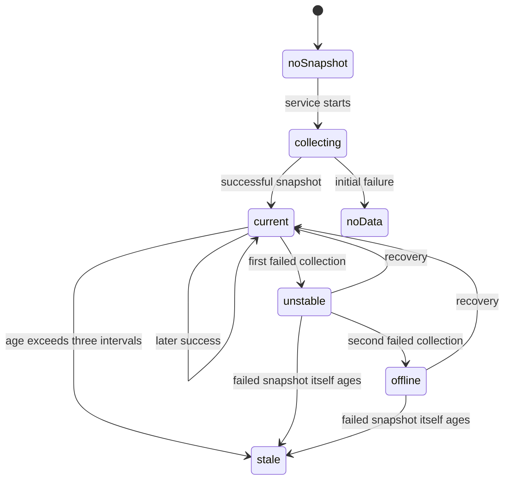

# Collection and freshness

## Summary

Clawbar separates collection from rendering. A service starts bounded collector processes; the bar and panel read only an atomically replaced Snapshot. This keeps Gateway delay and failure out of the interactive surface while giving freshness an independent, visible meaning.

This document owns intervals, deadlines, serialization, snapshot replacement, failure progression, Last Known Metadata, and the stale boundary.

## The simple case

Enabling Clawbar starts collection immediately. With the default configuration, another collection is requested every 30 seconds. A successful collection resolves one Gateway, collects bounded metadata, publishes a snapshot, and records current success time.

The widget reads the snapshot without waiting for Gateway commands. Once per second, it compares the in-memory snapshot's generation time with its accepted refresh interval so that an old snapshot can become Stale even when no new file arrives.

## Collection lifecycle

### Schedule and interval

The default interval is 30 seconds. `CLAWBAR_REFRESH_INTERVAL_SECONDS` may set a whole number from 15 through 300 before Omarchy Shell starts. A missing, non-numeric, fractional, or out-of-range value uses 30 seconds.

The accepted interval is written into each snapshot and defines its freshness boundary. Changing the environment requires a shell restart; an already running service does not treat the value as live panel state.

The repeating timer triggers once at service start and then at each interval. Manual refresh adds requests but does not reset the repeating schedule.

### Whole-collection deadline

One collector has a 12-second deadline shared by resolution, Gateway validation, and metadata work. Time spent resolving a Node-host Gateway leaves less time for the later Gateway probe and metadata calls.

A slow Gateway cannot create overlapping collector processes. If another scheduled or manual request arrives while collection or verification is busy, Clawbar remembers at most one pending refresh.

Candidate verification uses the same serialized service. A pending candidate runs before a pending ordinary refresh when current work stops.

### Snapshot publication and reading

A collector reduces data before publication and atomically replaces `snapshot.json`. Readers therefore see either the previous complete snapshot or the new complete snapshot, not a partially written file.

The bar requests a snapshot read after collection completes. If another read request arrives while reading, one pending read is retained and performed after the current read stops.

A valid snapshot must use schema version 1, contain a Gateway object, use a supported Gateway state, and contain a valid generation time whenever freshness applies. A failed initial cache read shows Collecting until collection has been attempted, then No data. A parse failure does not erase an existing in-memory snapshot.

### Success and degraded success

A fully successful collection publishes current Gateway, Fleet, Agent, and Automation metadata and resets consecutive failure count.

If core Gateway status succeeds but a metadata call fails, times out, exceeds a bound, or cannot be safely reduced, the Gateway is Degraded. Failed sections are unavailable and empty rather than copied forward. Degraded is current reachability, not Gateway loss.

### Failed collection after prior success

The first consecutive failure publishes Unstable Gateway and retains the prior successful metadata under Last Known Metadata. The second consecutive failure publishes Offline Gateway. A later success returns to a current state and can generate one recovery notification for the Incident period.

An initial failure with no prior success is No data, not Unstable. A reachable target whose structured response lacks the supported surface is Configuration Error rather than an ordinary reachability failure.

Raw output text never overrides structured status or process result. Private raw errors are discarded.

### Stale transition

A snapshot becomes Stale only when its age is greater than three accepted refresh intervals. At exactly three intervals it retains its recorded state. With the default interval, the transition occurs just after 90 seconds.

Stale presentation takes precedence over an old Healthy, Degraded, Unstable, Offline, or Configuration Error snapshot. Its current severity is warning and its Attention count is one. Rows are presented as Last Known Metadata with reduced emphasis and observation time.

Historical rows do not retain the old current Incident count. An old Offline Gateway or old Automation Failure therefore cannot remain red merely because its data is still visible after the snapshot becomes Stale.

## Last Known Metadata

Last Known Metadata preserves diagnostic context without claiming current health. It comes from the last successful collection when available; older compatible snapshots may use their own retained metadata.

Historical rows show `Last known`, reduced opacity, and a relative observation time. They cannot establish current Incidents or current Fleet counts. Their own recorded state, such as an Offline Node or failed Automation, remains visible as history rather than as a current alert.

## Interactions with other systems

**Privacy boundary.** The snapshot contains only reduced Operational Metadata. Atomic publication does not make raw intermediate output a supported state file.

**Collection and freshness.** This document is the owner. Other documents link here for the 15–300-second accepted range, 30-second default, 12-second deadline, scheduling, coalescing, and stale rule.

**Selection and navigation.** Snapshot consumption can reorder, add, or remove rows. The selection foundation owns reconciliation after that replacement.

**Notifications and Incidents.** Collection observes Incident transitions. Deduplication is per desktop login, and stale historical conditions do not reassert their previous Incidents.

**Theme and accessibility.** Freshness is expressed by text (`Stale`, `Last known`), time, opacity, and severity color rather than by color alone.

**Plugin lifecycle.** Disable or removal unloads scheduling immediately. A collector already running can remain until the 12-second deadline. No daemon or systemd timer remains.

## Edge cases

- A value of 15 or 300 seconds is accepted; 14, 301, a fraction, or text uses 30 seconds in the UI service and is rejected by the collector's direct command-line parser.
- A snapshot is current at exactly three intervals old and Stale one millisecond later.
- One failed metadata section makes the current Gateway Degraded without copying that section's old values.
- A failed Gateway collection after prior success retains historical rows; an initial failure has no Last Known Metadata to show.
- Repeated requests during a slow collection cannot accumulate processes, but they can produce one follow-up collection.
- A stale transition can occur while a collection remains within its deadline.
- Snapshot replacement preserves the previous complete file if publication of a newly verified fallback cannot complete safely.
- An unreadable new file leaves an already loaded in-memory snapshot visible until another valid snapshot is consumed or its age changes the presentation.

## Open questions and verification

- Observe the exact visible sequence from plugin enable through first successful and first failed collection.
- Confirm that no partial row update is perceptible during atomic replacement on the running shell.
- Confirm whether the one-second freshness timer causes any visible boundary delay beyond one timer tick.
- Confirm the stale presentation for an old critical Automation snapshot and an old Offline Gateway snapshot.
- Confirm the user-visible behavior when the collector process itself cannot be launched, not merely when its Gateway command fails.

Verified against Clawbar commit `f08496e`.
