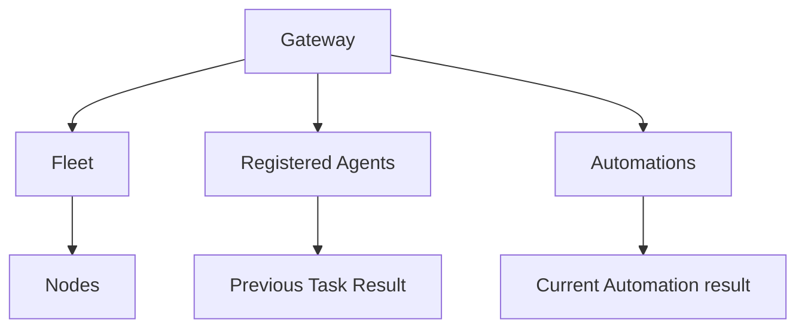

# Operational model

## Summary

Clawbar presents a bounded, read-only view of one OpenClaw Gateway. The Gateway owns the observations; Clawbar reduces them to Operational Metadata and arranges them as one Gateway summary followed by independent Fleet, Agents, and Automations sections.

This document owns the meaning and relationship of the objects. Feature documents own their visible row and detail behavior.

## The model

The arrows mean “reported by,” not visual containment or ownership that Clawbar can control. Agents and Automations are not assigned to Nodes because the supported Gateway metadata does not establish that relationship.

## Gateway and Gateway Target

Clawbar connects to exactly one Gateway Target per collection. The Gateway is the logical OpenClaw service; the Gateway Target is the resolved endpoint. A local Gateway, configured remote Gateway, Node-host record, or verified Tailscale fallback can supply the endpoint without changing the meaning of the Gateway shown in the panel.

Clawbar does not present credentials, endpoint URLs, hostnames, or private network identifiers. The resolution source affects healthy summary wording, such as Local, Remote, Node-host, or Verified Tailscale Gateway.

## Fleet and Nodes

The Fleet is a flat list of Nodes in Gateway order. Clawbar does not show connection topology, parent-child relationships, or direct probe results.

Each displayed Node represents the freshest connected registration for a display name when the Gateway returns duplicates. If none of the same-named registrations is connected, the chosen registration remains offline. Available platform, model, version, and observation time appear as bounded detail.

A Node UI Key preserves identity in the interface without revealing the private Node identifier. If Clawbar cannot derive safe keys for every Node, Fleet metadata becomes unavailable instead of falling back to positional or private identity.

An Offline Node is routine muted metadata. It does not roll up to Gateway health, Attention count, Incident state, or desktop notification. A Degraded Node means its core state is current while related Task metadata is unavailable; that child unavailability can roll up as degraded rather than offline.

## Agents and Tasks

Registered Agents appear after the Fleet and are omitted as a section when the list is empty. A static green dot confirms that the Gateway reported the registration; it does not establish health, online presence, or current activity. Task Result is historical: Succeeded, Failed, or None for the latest completed Task.

Registration and previous Task Result remain independent. A Registered Agent may have a Failed result without becoming a failed Agent. Failed Task Result is visible metadata but is not an Attention Item or Incident.

Clawbar does not display Task instructions, message content, destinations, accounts, raw failures, session events, current activity, or Node ownership. It uses Task records only to derive the bounded previous result.

## Automations

Automations appear after Agents in an independent section. Each has a name, enabled state, schedule kind, bounded next and last run timing, and a last result. The hidden Automation ID retains selection across refresh.

An enabled Automation whose last result is an error is an Automation Failure. It contributes one Attention Item regardless of consecutive failure count. Consecutive failure count is detail, not additional Incident count.

A disabled Automation stays visible but cannot create an Attention Item, even if its retained last result is an error. A skipped run is not a failure. A one-time Automation with a successful run and no next run is Completed. An event-driven Automation with no run waits for its event.

## Health roll-up

Gateway reachability and child metadata availability are separate from current Incidents:

- **Healthy Gateway:** core and requested metadata are current.
- **Degraded Gateway:** core status is current but one or more metadata sections are unavailable.
- **Unstable Gateway:** one collection failure after prior success.
- **Offline Gateway:** two consecutive collection failures after prior success.
- **Configuration Error:** target reachable but supported Gateway surface absent.
- **Gateway Setup Required:** no automatically resolved target and fallback setup incomplete.
- **Stale Snapshot:** snapshot older than three accepted intervals.

Automation Failures can make the bar and panel header critical while the Gateway itself remains healthy or degraded. Several current Incidents may roll up to a numeric header label, but they remain attached to their owning Gateway or Automation presentation rather than being duplicated in a separate list.

## Data boundaries and limits

Operational Metadata is intentionally smaller than the Gateway response. The collector discards Private Content during parsing. Snapshots and developer fixtures should therefore be safe to inspect without revealing task text, messages, destinations, accounts, credentials, raw errors, endpoint URLs, or private Node and Tailscale identifiers.

Metadata collections are bounded. When a section exceeds its accepted limit or cannot be safely reduced in full, Clawbar marks that section unavailable instead of presenting a partial set as complete health. Automation collection, for example, accepts at most 500 reduced items even though collection requests pages from the Gateway.

## Interactions with other systems

**Privacy boundary.** This model is the privacy allowlist. A field outside the bounded operational meanings is not made user-visible merely because the Gateway returns it.

**Collection and freshness.** Only current metadata can establish live object health. Historical Fleet, Agent, and Automation rows are Last Known Metadata.

**Selection and navigation.** Nodes use Node UI Keys; Agents use bounded stable keys; Automations use hidden Automation IDs. These keys support interface identity and are not displayed.

**Notifications and Incidents.** Offline Gateway, Configuration Error, and Automation Failure form Incident periods. Offline Nodes and Failed Task Results do not.

**Theme and accessibility.** Shape, color, text, opacity, and explicit labels distinguish state. Healthy routine labels may be visually quiet while remaining available to accessibility semantics. A Registered Agent uses a static green dot and exposes `Registered Agent` accessibly without claiming health or activity.

**Plugin lifecycle.** Disabling or removing Clawbar stops observation. It does not alter Gateway, Node, Agent, Task, or Automation state.

## Open questions and verification

- Confirm how Degraded Node is represented in the current running panel; source vocabulary defines it, but fixture coverage should be observed.
- Confirm the shell exposes the explicit accessible name and description for healthy Node and Automation rows and for the Registered Agent dot.
- Confirm the user-visible result when each metadata section hits its bound; automated tests establish availability state but not every layout consequence.

Verified against Clawbar commit `e1af66c`.
