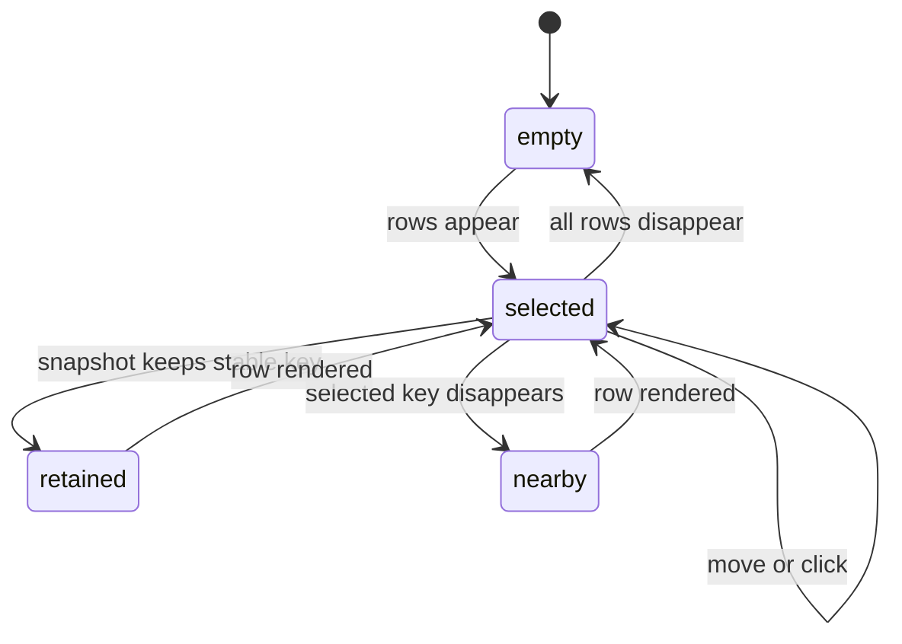

# Selection model

## Summary

The open panel has one Selection across every actionable row. Gateway candidates come first during setup; otherwise Nodes come first, followed by Agents and Automations. Selection controls which operational row expands its bounded detail and follows stable identity when a new snapshot changes order.

This document owns row order, movement, wrapping, identity, reconciliation, visibility, and inline detail placement.

## The simple case

When rows exist, the panel selects one row. The user presses Down or `j` to move forward and Up or `k` to move backward. Movement crosses section boundaries and wraps at both ends.

A pointer click selects the clicked Node, Agent, or Automation. Clicking a Gateway candidate both selects and activates it when verification is available. The selected row receives the panel's selected fill and border. A selected Node, Agent, or Automation expands its bounded detail directly beneath its own row; selecting another operational row collapses the old detail and expands the new one.

## Selection lifecycle

### Ordered rows

The selection order is Gateway candidates, Fleet Nodes, Agents, then Automations. Empty sections add no rows. This is one continuous order rather than separate keyboard groups.

Candidate rows appear only in Gateway Setup Required or Configuration Error when setup data includes candidates. Fleet, Agents, and Automations use current metadata or Last Known Metadata according to the snapshot state.

### Initial selection

When rows first appear and no stable selected key exists, selection uses the current index hint, clamped into the available range. The starting hint is zero, so the first row becomes selected in the ordinary first-load case.

When there are no rows, the selected key is empty and selected index is `-1`. Movement and activation do nothing.

### Movement and wrapping

Down, Right, `j`, and `J` move one row forward where the panel exposes horizontal movement to the same handler. Up, Left, `k`, and `K` move one row backward. The last row wraps to the first; the first wraps to the last.

After keyboard movement, Clawbar scrolls just enough to make the selected row visible. A row above the viewport aligns its top with the viewport top. A row below aligns its bottom with the viewport bottom. Selection does not scroll when the row is already fully visible.

### Pointer selection and activation

Clicking a Node or Agent selects it. Clicking an Automation selects it through the Automation section. These clicks do not send control commands to OpenClaw.

Clicking a Gateway candidate selects and immediately asks to verify it unless candidate verification is already busy. Pressing Enter activates the selected row only when it is a candidate; Enter on a Node, Agent, or Automation has no documented effect.

### Snapshot reconciliation

Each new row set is reconciled against the selected stable key. If the same key remains, selection follows it even when its index changes. Node UI Keys and Automation IDs are designed for this purpose.

If the selected key disappears, Clawbar uses the previous index hint, clamped to the new row count. This usually selects the row that moved into the removed row's position; if the old position lies beyond the end, the new last row is selected.

If all rows disappear, selection clears. When rows later return, the retained index hint is normalized and a row is selected.

### Detail placement

Selection, not an independent disclosure control, determines detail. There is no separate expanded/collapsed state for each row. Selecting a different operational row collapses the prior inline card and expands the new row's card.

The Node summary owns its name and state; the inline detail adds available platform/model/version, last-seen time, and collection observation time. The Agent summary owns its name, static registration marker, and compact previous Task Result; the inline detail adds Task Result completion and observation times without claiming current activity. Automation detail contains bounded status, kind, and timing. Candidate rows do not expand a detail card; their `Verify` label changes to `Verifying…` while the selected candidate is being checked.

Historical selections prefix detail with Last known and its observation age. Stable selection does not turn old metadata into current state.

## Variants

| Variant | At selection input | If it changes after selection |
| --- | --- | --- |
| Input method | Pointer chooses an exact row. Keyboard moves relative to the current index and wraps. | Both update the same selected key. Switching method creates no second focus or expansion state. |
| Panel visibility | Selection input requires the open panel; keyboard input also requires focus. | Closing preserves the panel object's selection while hidden. Reopening should show the reconciled current selection. |
| Snapshot freshness | Current and historical rows participate in the same order. | Becoming historical changes row emphasis and detail labels, not stable-key identity. |
| Gateway state | Setup states may replace operational rows with candidates; other states may expose current or Last Known rows. | Reconciliation retains a shared key when possible and otherwise uses the nearby index rule. |

## Cancel and interrupt

| Event | Before movement | After selection changes |
| --- | --- | --- |
| Escape or closing the panel | The panel closes without changing the selected key. | The current selection remains owned by the hidden panel object. |
| Starting another Clawbar Action | A pointer click or movement becomes the new selection Action. | Refresh and verification can run without locking selection; candidate activation may begin verification. |
| A scheduled or manual refresh completing | A new row set may arrive before input and determines the starting index. | Reconciliation follows the stable key or chooses the nearby surviving row. |
| Omarchy Shell losing focus, restarting, or exiting | Focus loss stops keyboard input. | Shell restart recreates UI state; persistence of selection across restart is not promised. |
| The snapshot changing, becoming stale, or becoming unreadable | A valid change rebuilds rows; unreadable input preserves an existing in-memory row set. | Stable-key reconciliation applies. Historical transition changes labels and opacity. |
| The plugin being disabled, updated, or removed | The panel becomes unavailable. | Selection is not OpenClaw state and has no promised persistence after reload. |
| Switching between pointer and keyboard input | Either route acts on the one current selection. | No effect beyond the next exact or relative movement. |
| Gateway resolution or reachability changing | The current row set stays until a snapshot reflects the change. | The resulting state may replace operational rows with candidates or historical rows, invoking reconciliation. |

## Interactions with other systems

**Privacy boundary.** Stable keys and hidden Automation IDs support UI identity but are not displayed. Private raw identifiers must not be substituted when safe keys are unavailable.

**Collection and freshness.** Snapshot consumption is the main source of row replacement. Historical transition preserves diagnostic rows but changes their presentation.

**Selection and navigation.** This document is the owner. Other documents specify only feature-specific activation and detail content.

**Notifications and Incidents.** Selection does not acknowledge, dismiss, duplicate, or clear an Incident. Selecting a failed Automation is inspection only.

**Theme and accessibility.** Selection uses fill and border in addition to row content. Keyboard movement, automatic scrolling, and explicit state labels provide non-pointer access; focus rendering inherited from the panel requires observation.

**Plugin lifecycle.** Selection is session-local UI state. It is not stored in the snapshot and does not survive a recreated plugin instance by contract.

## Edge cases

- Movement with zero rows does nothing and leaves no selection.
- Moving forward from an invalid index with rows starts from the first row and then advances once, yielding the second row when more than one exists.
- Duplicate Node display names do not define selection identity; safe Node UI Keys do.
- A selected Node registration can be replaced while keeping the same display-derived UI identity, so selection remains on the visible Node name.
- If safe Node keys cannot be derived, Fleet becomes unavailable instead of creating empty or positional keys for real snapshots.
- Removing the selected last row selects the new last row.
- Reordering several sections can move the selected row far on screen; Clawbar scrolls after reconciliation only when the selected delegate can be resolved.
- Candidate pointer clicks both select and activate; operational row clicks only select.
- Enter on a non-candidate row has no effect.

## Open questions and verification

- Confirm initial focus and selection when the panel first opens before and after the first snapshot.
- Confirm selection and scroll position after a selected row moves between visible viewport boundaries during refresh.
- Confirm whether closing and reopening preserves selection in every inherited panel dismissal path.
- Confirm accessible focus indication and announced detail changes for keyboard-only and screen-reader use.
- Confirm the exact behavior of Left and Right keys through the shared panel key catcher.

Verified against Clawbar commit `e1af66c`.
