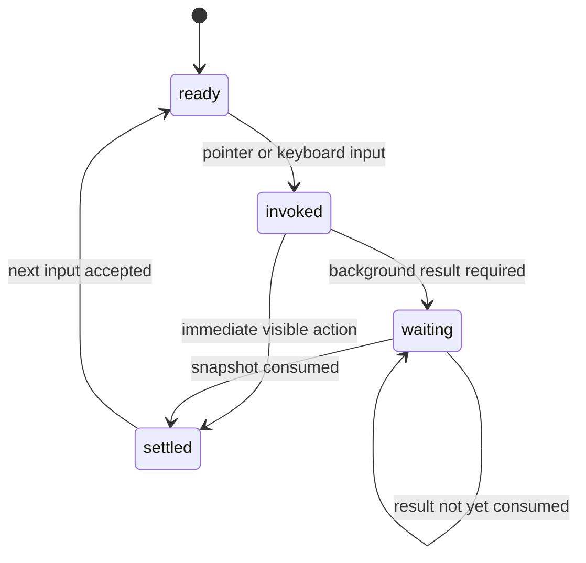

# Surface and actions

## Summary

Clawbar has two visible surfaces: a compact [bar widget](../glossary.md#the-surface) and one anchored [panel](../glossary.md#the-surface). The widget is always the entry point. The panel adds status, rows, bounded detail, keyboard navigation, refresh, and fallback setup without becoming a separate application window.

An [Action](../glossary.md#actions-and-input) is the smallest user interaction described by this set. Actions can settle immediately, such as moving selection, or wait for collection or candidate verification.

## The simple case

The user presses the claw mark. The panel opens beside the widget, receives keyboard focus, and shows the Gateway summary and available operational rows. The user moves the one selection, reads the detail below the selected row, and presses Escape to close the panel.

The bar remains present after the panel closes. Background collection belongs to the plugin service rather than to the panel session, so opening and closing the panel does not start or stop the schedule.

## The action lifecycle

### Ready

The required surface and target exist. A bar action requires the widget. A keyboard panel action also requires the open panel and its focus target. An action documents its current panel visibility, snapshot freshness, and Gateway state because those axes alter what the user sees before and after input.

### Invoked

Clawbar identifies the action from the input. A normal widget press toggles the panel; a middle-click requests collection. In the panel, arrow keys and `j`/`k` move selection, Enter activates a selected Gateway candidate, `r` requests collection, and Escape closes.

### Waiting begins

Only actions that need an external result enter Waiting. Manual refresh launches collection; Gateway candidate activation launches verification. Panel toggling and selection movement settle immediately.

Waiting does not lock the panel. The current snapshot and selection remain usable unless a new snapshot changes them.

### While waiting

The user may navigate, close, or reopen the panel. Collection and verification are serialized, while repeat refreshes coalesce. A user-requested refresh prefixes the panel summary with `Refreshing…`; scheduled collection stays quiet. Candidate verification disables candidate pointer actions and labels the selected candidate `Verifying…`.

### Settled

An immediate action settles when its visible state changes. An asynchronous action settles when Clawbar consumes the resulting snapshot, including a failure-state snapshot. The surface returns to Ready without requiring an acknowledgement.

## Fixed variants

| Variant | Meaning throughout this set |
| --- | --- |
| Input method | Pointer and keyboard routes that invoke the same product action. A document states when one route is unavailable. |
| Panel visibility | Whether the anchored panel is closed, open without the relevant focus, or open with keyboard focus. |
| Snapshot freshness | No usable snapshot, current metadata, or Last Known Metadata after failure or staleness. |
| Gateway state | Setup Required, Healthy, Degraded, Unstable, Offline, Configuration Error, No data, Stale, or another documented presentation state. |

A variant that changes during an immediate Action normally affects only the next Action. During Waiting, snapshot freshness and Gateway state may change before the requested result arrives.

## Fixed cancel and interrupt list

Every interaction document asks these questions in this order:

1. Escape or closing the panel.
2. Starting another Clawbar Action.
3. A scheduled or manual refresh completing.
4. Omarchy Shell losing focus, restarting, or exiting.
5. The snapshot changing, becoming stale, or becoming unreadable.
6. The plugin being disabled, updated, or removed.
7. Switching between pointer and keyboard input.
8. Gateway resolution or reachability changing.

Close is not a global cancellation command. It hides the panel but does not cancel collection or verification. Clawbar has no user-facing command that terminates an in-flight collector.

## Fixed cross-cutting concerns

Every interaction document considers these systems in this order:

1. **Privacy boundary.** Whether the Action can expose or persist anything beyond Operational Metadata.
2. **Collection and freshness.** Whether the Action starts collection, consumes a snapshot, or changes the interpretation of age.
3. **Selection and navigation.** Whether row ordering, focus, scrolling, selection, or detail changes.
4. **Notifications and Incidents.** Whether the Action can observe a transition that counts or notifies.
5. **Theme and accessibility.** Keyboard reachability, text labels, color, focus, panel sizing, and reduced motion.
6. **Plugin lifecycle.** What enabling, disabling, updating, removing, or shell restart does to the Action.

## Edge cases

- The panel may contain no selectable rows. Its summary and empty or unavailable guidance remain visible.
- Candidate verification is the only row activation that performs work. Selecting Nodes, Agents, and Automations changes detail only.
- A pointer click selects a row directly. Keyboard navigation wraps from the last row to the first and from the first to the last.
- Collection may update the hidden panel. Reopening reads the current in-memory state rather than starting a new panel-local session.
- The bar has no separate status dot or numeric badge. Its claw color and tooltip carry compact state.

## Open questions and verification

- Confirm focus placement and restoration when the panel opens, closes, and reopens in Omarchy Shell.
- Confirm outside-click behavior because the source component owns generic panel dismissal outside Clawbar's files.
- Confirm pointer button-code behavior on the supported compositor and input devices.
- Confirm whether reduced-motion settings affect any inherited panel transition.

Verified against Clawbar commit `f08496e`.
