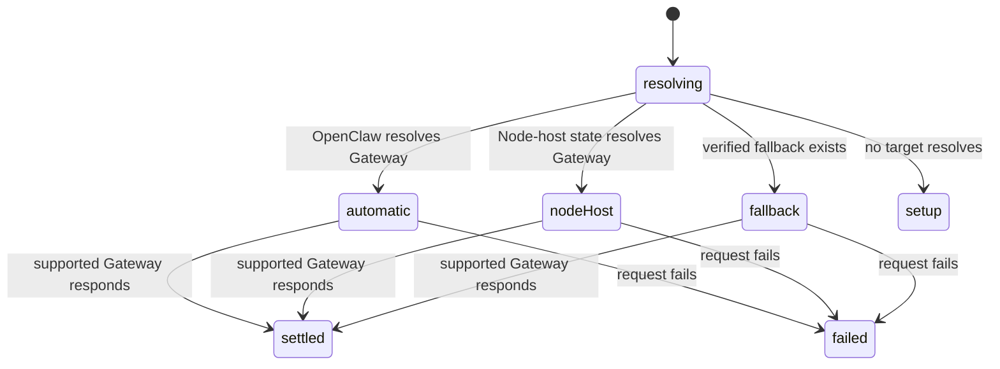

# Automatic Gateway resolution

## Summary

Before Clawbar can collect Fleet metadata, it resolves exactly one Gateway Target. It first lets OpenClaw identify its normal local or configured remote Gateway. On a Node host, it can use OpenClaw-owned Node-host connection state. Only when those routes identify no Gateway does Clawbar reuse a previously verified Tailscale fallback or enter [fallback setup](fallback-setup.md).

Resolution is automatic and private. The panel does not display endpoint URLs, credentials, private host identifiers, or a chooser when OpenClaw already knows the Gateway.

## The simple case

Clawbar starts collection. The local OpenClaw command resolves and validates its normal Gateway without Clawbar supplying an endpoint. Collection continues against that one Gateway and the healthy summary says whether resolution was Local or Remote.

On a Node host, Clawbar reads OpenClaw's stored Gateway connection metadata, validates that target, and labels the result Node-host. It never turns the Node list into a set of targets and never probes Nodes in parallel.

## The action, event by event

### Ready

Resolution begins as part of scheduled, manual, or candidate-verification collection. It uses the target state and OpenClaw environment available to that collector process. The current panel remains visible while resolution runs.

### Invoked

Clawbar first asks OpenClaw for Gateway status without injecting a URL. A valid structured response establishes local or configured-remote resolution. If the environment is a Node host and the direct route does not establish the Gateway, Clawbar asks OpenClaw for its Node-host state and validates the recorded Gateway endpoint.

If automatic resolution is absent, Clawbar may reuse a private state file containing a previously verified Tailscale fallback. It does not enumerate candidates on every normal collection.

### Waiting begins

The resolved target is validated through the supported read-only Gateway JSON surface within the shared 12-second whole-collection deadline. A reported URL is not persisted merely because the Gateway returns it, particularly when it could contain credentials.

### While waiting

Clawbar connects to only the chosen target. It does not fan out to Nodes or alternative Tailscale devices. A slow resolution step consumes time from the same deadline used by validation and metadata collection.

The panel continues to show the prior Snapshot. A change to OpenClaw configuration during this process does not rewrite the in-flight request; it can affect the next collector.

### Settled

A supported response records only the resolution source—local, configured remote, Node host, or Tailscale—in the public Snapshot. A healthy summary names that source without exposing its endpoint.

If a previously resolved Gateway later fails, the result follows the failure progression in [Health and Last Known state](health-and-last-known-state.md). Clawbar does not silently switch to candidate enumeration after a known local, remote, Node-host, or verified fallback target merely fails.

If no route identifies a target, the result is Gateway Setup Required. Tailscale candidates are listed only in that setup path.

## Variants

| Variant | At invocation | If it changes while waiting |
| --- | --- | --- |
| Input method | Scheduled and manual refresh reach the same resolution path; input origin does not change precedence. | No effect on the in-flight collector. |
| Panel visibility | Resolution runs with the panel open or closed. | Closing does not cancel it; reopening shows the current state until a result is consumed. |
| Snapshot freshness | Existing current or Last Known Metadata remains visible; a first run may show Collecting. | Existing data may become Stale before resolution settles. |
| Gateway state | A known target is retried according to its source. Setup Required permits candidate discovery. | Mid-run reachability or configuration changes affect the observed result or a later collector, not an alternate parallel probe. |

## Cancel and interrupt

| Event | Before waiting | While waiting |
| --- | --- | --- |
| Escape or closing the panel | No effect on background resolution. | The panel hides; resolution continues. |
| Starting another Clawbar Action | Selection and panel actions work normally. | Refresh coalesces; fallback verification waits rather than running beside resolution. |
| A scheduled or manual refresh completing | A prior result can change the current target state. | The current resolution settles; one pending refresh may run next. |
| Omarchy Shell losing focus, restarting, or exiting | Focus does not define the target. | Restart or exit unloads scheduling; an external collector remains bounded. |
| The snapshot changing, becoming stale, or becoming unreadable | Determines what remains visible while resolution starts. | Does not redirect the in-flight target; a valid result later replaces presentation. |
| The plugin being disabled, updated, or removed | Prevents new resolution work. | Stops future scheduling; current collector can run to its deadline. |
| Switching between pointer and keyboard input | No effect on target precedence. | No effect. |
| Gateway resolution or reachability changing | The new process observes current OpenClaw and private fallback state. | The selected route either responds or settles as a documented failure; Clawbar does not fan out. |

## Interactions with other systems

**Privacy boundary.** Endpoint URLs, credentials, Node-host identifiers, and verified fallback URLs remain outside the public Snapshot. Only resolution source and reduced operational result are visible.

**Collection and freshness.** Resolution shares the collection deadline and serialization. It precedes metadata collection and therefore can leave less time for later calls.

**Selection and navigation.** Resolution has no direct selection. Its resulting state can replace candidate rows with operational rows or move current rows into Last Known presentation.

**Notifications and Incidents.** A known target's failure can begin or continue an Incident. Merely lacking an automatically resolved target produces Gateway Setup Required, not an Incident.

**Theme and accessibility.** Resolution source appears in healthy summary text, not only color. Setup and failure states have explicit labels.

**Plugin lifecycle.** Verified fallback state may survive plugin reload as private per-user state. Disabling or removing does not configure OpenClaw itself.

## Edge cases

- Automatic OpenClaw resolution takes precedence even when a verified Tailscale fallback is stored; the stored fallback is preserved for later unresolved runs.
- A failing Node-host Gateway is treated as failure of that known Gateway, not as permission to enumerate Tailscale devices.
- A Gateway-reported URL containing credentials is not persisted as target state.
- A verified fallback is reused only after normal automatic routes are unresolved.
- A target can be reachable but unsupported, producing Configuration Error rather than Offline.
- Resolution and validation share one deadline, so a slow Node-host lookup can cause the later probe to time out.

## Open questions and verification

- Observe summary wording for all four successful resolution sources in the running panel.
- Confirm whether a user can distinguish a slow resolution step from slow metadata collection; neither has a dedicated progress label.
- Confirm behavior after OpenClaw configuration changes while the shell stays running and before the next scheduled collector.

Verified against Clawbar commit `f08496e`.
