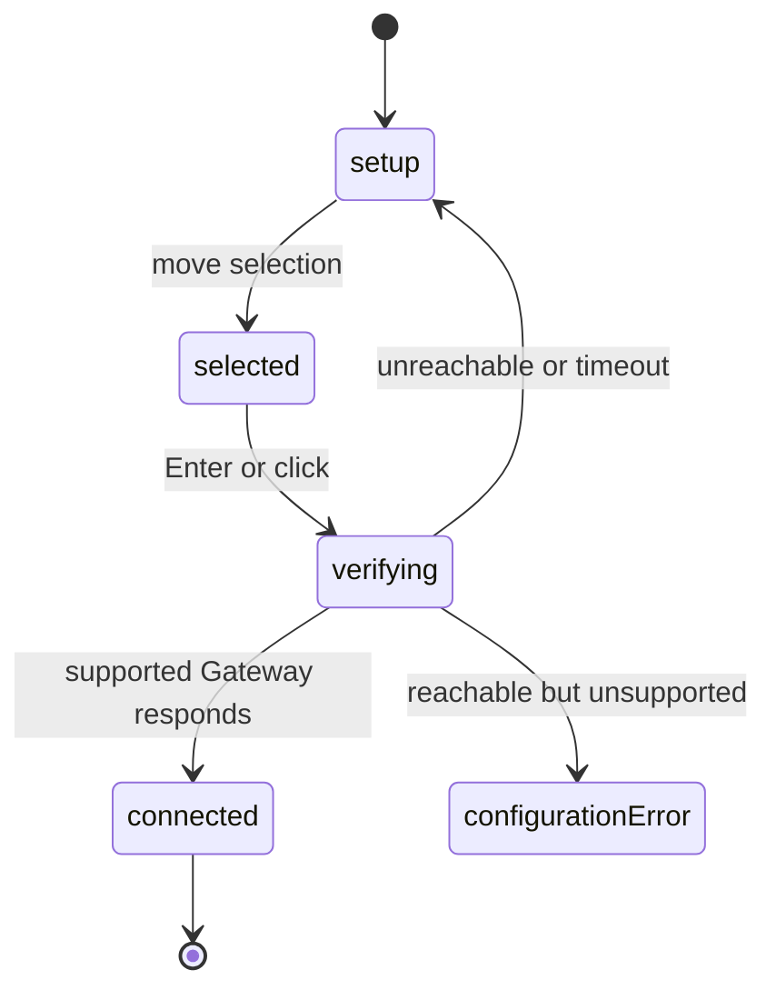

# Fallback Gateway setup

## Summary

Fallback setup appears only when OpenClaw cannot resolve a local, configured remote, or Node-host Gateway and no reusable verified fallback completes resolution. Clawbar lists online Tailscale devices as Gateway candidates, lets the user select one, and accepts it only after the supported read-only Gateway JSON surface responds.

Setup does not ask for a token or password. Gateway Setup Required is yellow, contributes no Attention Item, and is not an Incident.

## The simple case

The panel shows `GATEWAY SETUP REQUIRED`, guidance, and one row per online Tailscale candidate. The user moves selection with `j`/`k` or the arrow keys and presses Enter, or clicks a candidate row.

The selected row says `Verifying…` while the bounded probe runs. On success, Clawbar stores the verified fallback privately, collects operational metadata, and replaces setup rows with the normal Fleet, Agents, and Automations presentation.

## The action, event by event

### Ready

The current snapshot is Gateway Setup Required or a Configuration Error that still contains setup candidates. Candidate rows use stable opaque Gateway Candidate Keys. Offline Tailscale devices and the current device are not offered as selectable peers.

When no candidate is available, the panel instructs the user to connect Tailscale and refresh. There is no empty dropdown or password field.

### Invoked

Keyboard Enter activates only the selected candidate. A pointer click first selects its candidate and then activates it. Candidate input is disabled while verification is already running.

The public action supplies only the opaque candidate key. Private state maps that key to the endpoint used by the collector.

### Waiting begins

The selected candidate row changes its action text from `Verify` to `Verifying…`. Candidate verification and ordinary collection are serialized; verification never overlaps the collector.

The whole verification and collection path remains bounded by the 12-second deadline. Other candidate rows are also disabled while verification is active.

### While waiting

The panel stays open and navigation code remains present, but candidate pointer activation is disabled. A refresh request becomes pending. If another verification request is somehow delivered while work is busy, the latest pending candidate replaces an earlier pending candidate.

Clawbar probes only the selected device. It requires the supported read-only Gateway response and does not accept Tailscale online status as proof that the device is a Gateway.

### Settled

On success, Clawbar privately stores the verified fallback with mode `0600`, publishes a healthy snapshot with resolution source Tailscale, and uses that fallback on later unresolved collections. Public snapshots contain neither private Tailscale identifiers nor the endpoint.

If the candidate cannot be reached, setup remains required and the panel explains that verification failed. If it times out, setup remains required and the panel tells the user to check Tailscale and try again. Neither failure accepts or stores the candidate as verified.

If the device responds but lacks the supported Gateway command surface, Clawbar shows Configuration Error and says the selected device does not provide a supported OpenClaw Gateway. Candidate rows may remain available for another choice.

## Variants

| Variant | At invocation | If it changes while waiting |
| --- | --- | --- |
| Input method | Enter activates the selected candidate; click selects and activates an exact candidate. | Candidate activation is disabled while verification is active; switching input method does not change the target already chosen. |
| Panel visibility | Verification starts from the open setup panel. | Closing hides progress but does not cancel verification; reopening consumes the current result. |
| Snapshot freshness | Setup snapshots are not converted to Last Known operational rows merely by candidate selection. | A replacement setup, error, or healthy snapshot determines the settled view. |
| Gateway state | Setup Required permits verification; Configuration Error may retain candidates for another attempt. | A verified success replaces setup; unreachable and timeout preserve it; unsupported response produces Configuration Error. |

## Cancel and interrupt

| Event | Before waiting | While waiting |
| --- | --- | --- |
| Escape or closing the panel | Closes setup without changing the selected candidate or accepting it. | Hides the panel; verification continues. |
| Starting another Clawbar Action | Navigation changes selection; Enter or click starts verification. | Refresh waits. A later queued candidate may replace an earlier queued candidate, but the in-flight candidate is not cancelled. |
| A scheduled or manual refresh completing | Can update the candidate set and reconcile selection. | Current verification settles before queued ordinary refresh. |
| Omarchy Shell losing focus, restarting, or exiting | Focus loss stops keyboard activation. | Shell exit unloads the service; the external verifier remains bounded. Persistence of its late result needs observation. |
| The snapshot changing, becoming stale, or becoming unreadable | Candidate list can reorder while stable keys retain selection. | The verification result is consumed as a later snapshot; unreadable input does not itself verify a target. |
| The plugin being disabled, updated, or removed | Setup becomes unavailable. | Future scheduling stops; no candidate is accepted without successful private-state publication. |
| Switching between pointer and keyboard input | Both routes refer to the same selected key. | No effect on the in-flight target. |
| Gateway resolution or reachability changing | A newly automatic Gateway can remove the need for fallback on a later collection. | The selected endpoint must answer during its own probe; Clawbar does not switch target mid-verification. |

There is no explicit Cancel Verification control. Escape cancels only the visible panel session.

## Interactions with other systems

**Privacy boundary.** Candidate keys, not private Tailscale IDs or addresses, enter the snapshot. Private mappings and verified target state are mode `0600`; tokens and passwords are neither requested nor stored.

**Collection and freshness.** Candidate discovery and verification use the shared collector and deadline. Success flows directly into operational collection and snapshot publication.

**Selection and navigation.** Candidate keys keep selection attached to the same device across reorder or display-name change. Clicking a candidate combines selection and activation, unlike operational rows.

**Notifications and Incidents.** Gateway Setup Required and failed candidate verification are not Incidents. An unsupported verified target is a Configuration Error and therefore an Incident.

**Theme and accessibility.** Setup uses a yellow heading, guidance text, selected-row styling, keyboard navigation, and explicit `Verify`/`Verifying…` labels.

**Plugin lifecycle.** A verified fallback is reused across later unresolved collections. Automatic OpenClaw resolution does not delete or overwrite it. Removing plugin state outside Clawbar's documented lifecycle is out of scope.

## Edge cases

- Without Tailscale, setup stays non-Incident and displays actionable connection guidance.
- Only online peers are listed; the current device and offline peers are excluded.
- Candidate order and display names may change while opaque keys remain attached to devices.
- If safe candidate keys cannot be derived, existing candidates may remain visible with a private-safe repair error; new unsafe identities are not exposed.
- An unknown candidate key does not verify or store a target.
- Failure to write verified target state leaves the previous published snapshot intact.
- An unsafe Gateway-reported URL cannot replace the selected candidate's safe private endpoint state.
- A stored verified fallback survives a period in which automatic configured-remote resolution succeeds and is reused later when automatic resolution is absent.

## Open questions and verification

- Verify candidate row disabling, `Verifying…` placement, and keyboard behavior during a deliberately slow probe.
- Verify focus and selected-row retention after a candidate list reorder.
- Verify every error message at narrow panel width and in light and dark themes.
- Verify what the user sees if Omarchy Shell restarts while the external candidate verifier is still running.
- The panel offers no explicit way to forget or replace a working verified fallback; confirm whether this is an intentional product boundary.

Verified against Clawbar commit `f08496e`.
