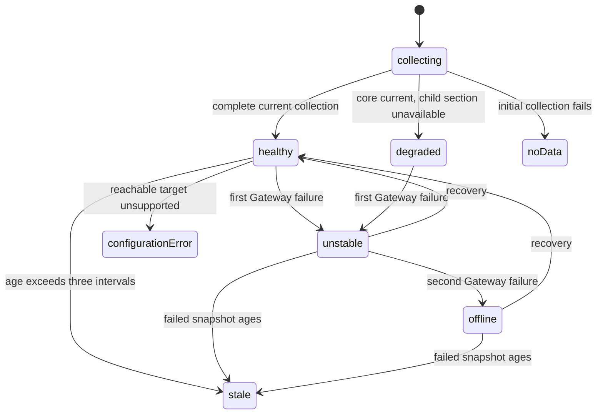

# Gateway health and Last Known state

## Summary

Clawbar separates Gateway reachability, metadata completeness, snapshot freshness, and current Incidents. The panel can therefore show a Healthy Gateway with an Automation Failure, a Degraded Gateway with some unavailable sections, or historical rows beneath an Unstable, Offline, or Stale summary without presenting those rows as current.

This document owns the visible handoff among Gateway states and Last Known Metadata.

## The simple case

A successful collection shows a green Healthy Gateway header and current operational rows. If one metadata section fails while the core Gateway remains reachable, the header becomes Degraded and that section says its metadata is unavailable rather than repeating old values.

If the next whole Gateway collection fails, Clawbar shows Unstable and keeps the previous successful rows as Last Known Metadata. If a second consecutive collection fails, it shows Offline. A later successful collection restores current rows.

## The state sequence

### Ready

The current state comes from a valid in-memory Snapshot plus its age. Gateway Setup Required and No data have no successful current rows. Healthy and Degraded are current. Unstable, Offline, and Stale present rows historically when Last Known Metadata exists.

### Invoked

Health changes are not a direct user edit. A scheduled refresh, [manual refresh](../bar/manual-refresh.md), candidate verification, or the one-second freshness check causes Clawbar to reevaluate visible state.

### Waiting begins

During collection, Clawbar keeps an existing snapshot visible. Only the first run without a usable snapshot displays Collecting. There is no intermediate “testing health” state over current rows.

### While waiting

The existing snapshot can become Stale from age before the requested collection settles. Navigation remains available. Old current Incidents cease to count once Stale presentation takes precedence.

### Settled

A valid snapshot and current time determine one visible Gateway state:

- **Healthy:** core and sections are current; green unless current Automation Incidents roll the header and bar to critical.
- **Degraded:** core is current but one or more metadata sections are unavailable; yellow unless current Automation Incidents make the header critical.
- **Unstable:** one Gateway collection failure after prior success; yellow with Last Known rows.
- **Offline:** two consecutive Gateway failures; red with Last Known rows.
- **Configuration Error:** target is reachable but unsupported; red and actionable.
- **Gateway Setup Required:** no resolved target; yellow, setup guidance, no Incident.
- **No data:** collection attempted but no usable success exists; yellow.
- **Stale:** snapshot age exceeds three accepted intervals; yellow with Last Known rows and one Attention Item.

A later success replaces historical rows with current metadata. The selection follows stable keys where possible.

## Variants

| Variant | At reevaluation | If it changes while waiting |
| --- | --- | --- |
| Input method | Scheduled and manual collection produce the same state rules. | No effect on health semantics. |
| Panel visibility | Bar color and tooltip update even when the panel is closed. | Opening reveals the same current or historical state; closing does not freeze freshness. |
| Snapshot freshness | Age can override the recorded Gateway state with Stale. | Crossing the strict three-interval boundary changes severity and historical treatment before a new file arrives. |
| Gateway state | Recorded core reachability and metadata availability determine the non-stale state. | The next consumed snapshot records the observed transition; the current panel is not mutated directly by Gateway events. |

## Cancel and interrupt

| Event | Before waiting | While waiting |
| --- | --- | --- |
| Escape or closing the panel | Hides detail but leaves bar health visible. | Does not stop collection or freshness reevaluation. |
| Starting another Clawbar Action | Selection and inspection do not alter health; refresh may begin observation. | A pending refresh can produce a later transition but does not cancel the current observation. |
| A scheduled or manual refresh completing | Consumes the newest valid health result. | Settles Healthy, Degraded, failure progression, setup, or configuration state. |
| Omarchy Shell losing focus, restarting, or exiting | Focus does not change health. | Restart recreates in-memory state from the persisted snapshot; exit stops visible freshness updates. |
| The snapshot changing, becoming stale, or becoming unreadable | Valid replacement or age determines health. | Unreadable replacement preserves an existing in-memory snapshot; age may still turn it Stale. |
| The plugin being disabled, updated, or removed | Removes the visible health surface. | Stops future observation; it does not change OpenClaw health. |
| Switching between pointer and keyboard input | No effect on health. | No effect. |
| Gateway resolution or reachability changing | Becomes visible only through a collector result. | The in-flight collector observes success, degraded metadata, unsupported surface, or failure within its deadline. |

## Interactions with other systems

**Privacy boundary.** Health is generalized. Raw errors, URLs, credentials, and private content are not shown to explain a state.

**Collection and freshness.** [Collection and freshness](../foundations/collection-and-freshness.md) owns timing, failure count, snapshot age, and publication. This document owns their visible state handoff.

**Selection and navigation.** Current-to-historical transitions retain rows and stable selection where possible. Setup or no-data states can remove operational rows and clear or relocate selection.

**Notifications and Incidents.** Offline and Configuration Error are Gateway Incidents. Unstable, Degraded, and Stale are Attention Items but not all are notification-producing Incident definitions. Recovery notification follows the end of a continuous Incident, not every healthy refresh.

**Theme and accessibility.** Healthy, warning, and critical tones use theme-derived colors plus explicit labels and tooltip text. Historical rows add reduced opacity, `Last known`, and time.

**Plugin lifecycle.** A persisted snapshot can seed presentation after reload. Disabling or removing ends observation and notification scheduling without changing the Gateway.

## Edge cases

- Healthy Gateway plus one Automation Failure is critical at the bar and may say `Automation Failure` in the header while Gateway reachability remains healthy.
- More than one current Incident yields a count label such as `3 Incidents` in the header.
- Degraded Gateway plus Automation Failures can be critical rather than merely warning.
- Stale takes precedence over an old Offline Gateway and changes current severity from critical to warning.
- Historical Offline Nodes remain visible but muted and still do not count.
- An initial failure is No data; prior success is required for Unstable and Last Known Metadata.
- Configuration Error can include fallback candidates when it came from an unsupported candidate, but can show only repair guidance for a configured target.
- Empty Fleet is compatible with Healthy Gateway.

## Open questions and verification

- Observe all accepted states using the developer demonstration in the actual Omarchy panel.
- Confirm the exact header, tooltip, row opacity, and time labels at the stale boundary.
- Confirm grouped Incident wording when Gateway and Automation Incidents coexist.
- Confirm whether No data after collector-launch failure gives enough visible guidance; the source may leave the cause only in the shell console.
- Confirm recovery presentation when Last Known selection no longer exists in the recovered current snapshot.

Verified against Clawbar commit `f08496e`.
