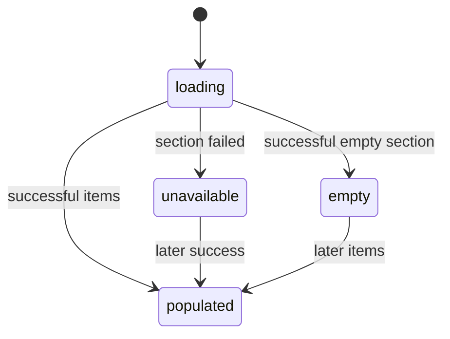

# Empty and unavailable states

## Summary

The panel distinguishes absence from failure. An Empty Fleet is current successful metadata with no Nodes; `No Automations` is an available empty section; an empty Agents section is omitted. Unavailable metadata appears only when the current Gateway is Degraded. First-run and setup states use separate guidance.

## The simple case

A connected Gateway reports no Nodes. The panel keeps a Healthy header, shows `FLEET`, then `Empty Fleet`. If there are no Agents, their heading is omitted. If there are no Automations, the Automations heading remains and says `No Automations`.

When a metadata section fails, the Gateway is Degraded and the affected section says it is unavailable instead of showing carried-forward values.

## The action, event by event

### Ready

The panel can open before any usable Snapshot, with setup data, or with current or historical operational metadata.

### Invoked

Opening the panel or consuming a Snapshot selects the applicable presentation. The user does not manually choose empty versus unavailable.

### Waiting begins

First-run collection shows Collecting. Existing data stays visible during later collection and is not replaced with a generic loading screen.

### While waiting

Selection and scrolling remain available. Existing data can become Last Known Metadata if the Snapshot becomes Stale.

### Settled

No initial success settles as `No data yet`. Setup Required shows setup guidance. A current empty section says Empty Fleet or No Automations; empty Agents disappear. A failed current section says metadata unavailable. More than 500 Automations has its own explicit unavailable reason, as does a Fleet or Agent/Task section whose collection output exceeded the bounded-size limit (`Unavailable — metadata response exceeded the collection limit`).

## Variants

| Variant | At invocation | If it changes while waiting |
| --- | --- | --- |
| Input method | Opening and navigation do not change state meaning. | No effect. |
| Panel visibility | Closed hides guidance; open shows it. | Snapshot updates while hidden. |
| Snapshot freshness | Current emptiness is authoritative; Last Known rows are historical context. | Stale can replace current empty state with historical treatment. |
| Gateway state | Healthy permits empty sections; Degraded permits unavailable sections; Setup and No data replace operational layout. | Next Snapshot selects the new layout. |

## Cancel and interrupt

| Event | Before waiting | While waiting |
| --- | --- | --- |
| Escape or closing the panel | Hides the state without changing it. | Collection continues. |
| Starting another Clawbar Action | Refresh can seek new data; navigation acts only when rows exist. | Repeated refresh coalesces. |
| A scheduled or manual refresh completing | Can change empty, populated, or unavailable state. | Settles the new layout. |
| Omarchy Shell losing focus, restarting, or exiting | Focus does not alter meaning. | Restart rereads persisted state. |
| The snapshot changing, becoming stale, or becoming unreadable | Valid state selects presentation. | Unreadable replacement preserves an existing in-memory presentation. |
| The plugin being disabled, updated, or removed | Removes the panel. | No state remains visible after unload. |
| Switching between pointer and keyboard input | No effect on state. | No effect. |
| Gateway resolution or reachability changing | Not shown until collected. | Result may replace operational sections with setup or historical rows. |

## Interactions with other systems

**Privacy boundary.** Unavailable messages never substitute raw errors. Empty means a safe complete result, not a redacted count.

**Collection and freshness.** Degraded sections do not carry forward their earlier current values. Whole-Gateway failure can show those earlier values only as Last Known Metadata.

**Selection and navigation.** Empty sections add no rows. Row removal reconciles or clears Selection.

**Notifications and Incidents.** Empty sections are not Incidents. Degraded is an Attention Item; Setup Required is not.

**Theme and accessibility.** Empty and unavailable states use explicit text, not color alone.

**Plugin lifecycle.** Re-enable begins immediate collection and may briefly show persisted or first-run state.

## Edge cases

- Healthy Gateway and Empty Fleet can coexist.
- Agents heading is omitted when empty, unlike Automations.
- Automation count above 500 makes the entire section unavailable rather than truncating it.
- A metadata timeout degrades only current affected sections; prior successful values remain available only for later whole-Gateway Last Known fallback.
- Setup Required without Tailscale candidates gives connection guidance rather than an empty candidate list label.
- Configuration Error without setup candidates gives repair guidance rather than Fleet emptiness.

## Open questions and verification

- Confirm whether the different empty-section conventions are intentional and understandable.
- Observe all empty, unavailable, and first-run layouts at narrow width.
- Confirm accessibility announcement when a populated section becomes unavailable and Selection moves.

Verified against Clawbar commit `f08496e`.
