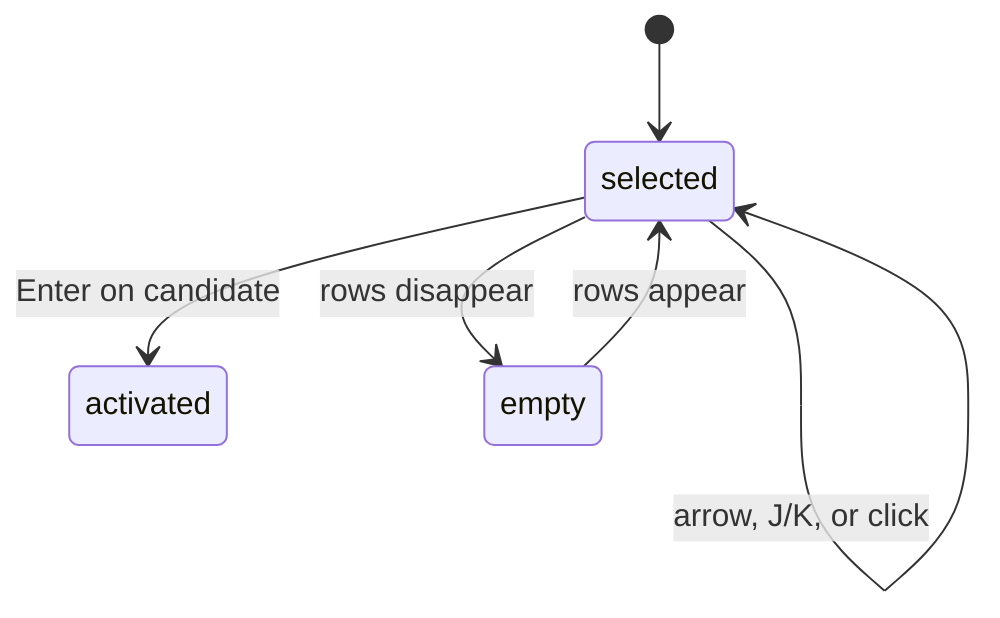

# Panel navigation and details

## Summary

The panel presents all actionable rows as one keyboard order and one Selection. Arrow keys or `j`/`k` move through candidates, Nodes, Agents, and Automations; pointer clicks select exact rows. The selected operational row expands its bounded detail in place, while a selected candidate can be activated.

## The simple case

The user opens the panel and presses Down. Selection moves to the next row and the panel scrolls enough to keep it visible. The selected row gains fill and a border; its detail appears beneath its summary.

Moving past the last row wraps to the first. Clicking a different row moves the single Selection and detail there.

## The action, event by event

### Ready

The panel is open and focused. If rows exist, [Selection model](../foundations/selection-model.md) determines the selected key and index.

### Invoked

Down, Right, `j`, or `J` moves forward; Up, Left, `k`, or `K` moves backward. Pointer click chooses an exact row. Enter activates only a Gateway candidate.

### Waiting begins

Selection state changes immediately. Candidate activation enters the verification flow; operational detail never waits for OpenClaw. For Node, Agent, and Automation rows, the selected surface and border update at once while the bounded detail uses a short reveal transition.

### While waiting

During candidate verification the user can still navigate by keyboard, but candidate pointer areas are disabled. Snapshot refresh can reorder rows and reconcile Selection.

### Settled

The selected row is made visible by scrolling within the list viewport below the pinned Gateway header, including while its detail height settles. When the list is taller than that viewport, a thin indicator at the right edge shows the visible proportion and scroll position. It becomes clearer during pointer or selection-follow scrolling, then settles to a quiet resting opacity. Node, Agent, and Automation rows expand their own detail beneath the row summary with one shared height and opacity timing. Candidate rows do not expand a detail card; the selected candidate's action text changes to `Verifying…` during verification.

## Variants

| Variant | At invocation | If it changes while waiting |
| --- | --- | --- |
| Input method | Keyboard moves relatively and wraps; pointer selects exactly. | Both update the same Selection. |
| Panel visibility | Navigation requires open focus. | Closing ends visible navigation but does not cancel candidate verification. |
| Snapshot freshness | Current and Last Known rows share navigation order; historical detail adds labels and time. | Reconciliation retains stable identity where possible. |
| Gateway state | Setup exposes candidates; normal and historical states expose operational rows. | Row replacement can retain, relocate, or clear Selection. |

## Cancel and interrupt

| Event | Before waiting | While waiting |
| --- | --- | --- |
| Escape or closing the panel | Closes without explicitly clearing Selection. | Candidate verification continues hidden. |
| Starting another Clawbar Action | A later movement replaces visible Selection; refresh does not lock it. | Candidate and refresh requests serialize. |
| A scheduled or manual refresh completing | Rebuilds rows and reconciles Selection. | Same; the selected detail can move. |
| Omarchy Shell losing focus, restarting, or exiting | Stops keyboard input. | Restart does not promise Selection persistence. |
| The snapshot changing, becoming stale, or becoming unreadable | Valid changes rebuild rows; unreadable input preserves current rows when possible. | Historical labels and opacity can change around the same selected key. |
| The plugin being disabled, updated, or removed | Removes navigation. | Session-local Selection is discarded on unload. |
| Switching between pointer and keyboard input | No separate focus model is created. | The next input acts on the shared Selection. |
| Gateway resolution or reachability changing | Has no direct effect before collection. | Resulting row set is reconciled. |

## Interactions with other systems

**Privacy boundary.** Detail cards show only bounded metadata and never hidden stable IDs, raw errors, task text, or endpoints.

**Collection and freshness.** Snapshot replacement is the only source of row data changes; navigation itself never queries the Gateway.

**Selection and navigation.** The [Selection model](../foundations/selection-model.md) owns order, wrap, key retention, nearby fallback, and scrolling.

**Notifications and Incidents.** Selecting an Incident row does not acknowledge or recover it.

**Theme and accessibility.** Selected fill and border supplement text. Automation rows expose accessible name and state description; other row accessibility must be checked in the shell.

**Plugin lifecycle.** Selection is not persisted as product state and is recreated with the panel instance.

## Edge cases

- With no rows, movement and Enter do nothing.
- Enter on Node, Agent, or Automation has no effect.
- Candidate click both selects and activates; operational click only selects.
- Selection can cross section boundaries and wrap from Automation to the first row.
- If the selected row disappears, the nearby index rule can select a different object without user input.
- Long detail content increases row height and may require automatic scrolling.
- A collapsing detail remains clipped to its row and leaves the accessibility tree as soon as the row loses Selection.
- The pinned Gateway header never participates in list scrolling, including selection-follow scrolling.
- The scroll indicator is absent when all rows fit and reserves enough horizontal space to avoid overlapping row content when present.

## Open questions and verification

- Confirm Left and Right behavior through the inherited key catcher.
- Confirm screen-reader announcements for Node and Agent rows and dynamic detail expansion.
- Confirm automatic scroll after reordering and after a detail increases row height.
- The silent Enter behavior on operational rows may be worth an accessibility review.

Verified against Clawbar commit `f08496e`.
