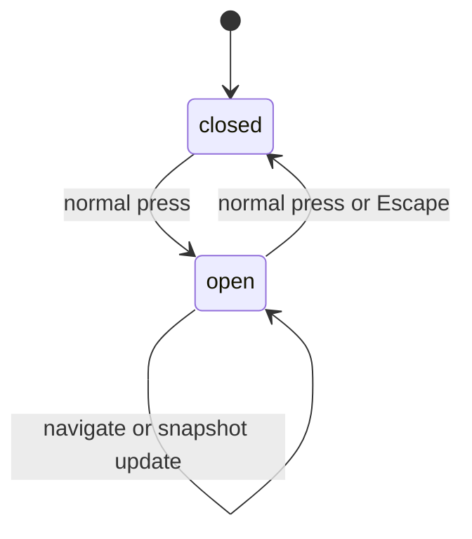

# Panel opening and closing

## Summary

A normal press on the bar widget toggles one panel anchored to the claw mark. Opening exposes the current summary, rows, and detail and directs keyboard input to the panel. Escape closes it. Panel visibility is independent of background collection.

## The simple case

The user presses Clawbar. The panel opens at a fitted width up to the shell's available space and a fitted height capped at the themed equivalent of 560 spacing units. The Gateway header remains pinned at the top while only the operational rows scroll. The panel key catcher receives focus.

The user reads or navigates, then presses Escape. The panel closes while the bar signal and collection schedule continue.

## The action, event by event

### Ready

The bar widget is present. The panel may be closed or open; one owner boolean controls its requested visibility.

### Invoked

Any non-middle widget press toggles visibility. Escape from the panel requests close. Middle-click is reserved for refresh and does not toggle.

### Waiting begins

Opening and closing settle immediately in Clawbar's state. Any inherited popup animation or compositor placement is outside the product code and requires observation.

### While waiting

There is no Clawbar waiting phase. Snapshot reading, collection, and verification can remain active independently while the panel opens or closes.

### Settled

When open, keyboard actions route to the panel focus target. When closed, panel keyboard shortcuts are unavailable; the widget and service remain active.

## Variants

| Variant | At invocation | If it changes while waiting |
| --- | --- | --- |
| Input method | Pointer toggles from the widget; keyboard Escape closes from inside the panel. | No Clawbar waiting phase. |
| Panel visibility | Closed becomes open; open becomes closed. | Repeated toggle reverses the current requested state. |
| Snapshot freshness | Opening shows current, historical, setup, or empty presentation already in memory. | A snapshot can update while open or hidden. |
| Gateway state | State changes panel contents but does not prevent opening or closing. | A later state is shown without reopening. |

## Cancel and interrupt

| Event | Before waiting | While waiting |
| --- | --- | --- |
| Escape or closing the panel | Closes an open panel; no effect when already closed through this surface. | No waiting phase; close takes effect on visibility. |
| Starting another Clawbar Action | Navigation and refresh require an open panel; widget toggle can close it. | Background Actions continue after close. |
| A scheduled or manual refresh completing | Closed state remains closed; open contents update. | Same. |
| Omarchy Shell losing focus, restarting, or exiting | Focus-loss dismissal depends on inherited panel behavior. | Restart recreates the panel closed unless shell restoration says otherwise. |
| The snapshot changing, becoming stale, or becoming unreadable | Does not force open or close. | Open content updates; closed panel remains hidden. |
| The plugin being disabled, updated, or removed | Unloads the panel. | An open panel disappears with the plugin. |
| Switching between pointer and keyboard input | Both share one panel. | No separate open state exists per input method. |
| Gateway resolution or reachability changing | Does not force visibility. | The next Snapshot updates hidden or visible content. |

## Interactions with other systems

**Privacy boundary.** Opening reveals only Operational Metadata already accepted for display.

**Collection and freshness.** Opening does not initiate collection; enable-time scheduling and manual refresh are separate.

**Selection and navigation.** The panel owns one session-local selection. Closing does not explicitly clear it.

**Notifications and Incidents.** Opening does not acknowledge or dismiss notifications or Incidents.

**Theme and accessibility.** The panel uses the shell's KeyboardPanel, fitted size, font, colors, and focus target. Escape provides a keyboard close route.

**Plugin lifecycle.** Disable, update reload, removal, or shell exit can remove the panel regardless of requested visibility.

## Edge cases

- Middle-click on a closed widget refreshes without opening.
- A snapshot can change while closed; the latest consumed state appears on next open.
- A panel taller than the cap keeps the Gateway header visible and scrolls only its operational rows rather than growing indefinitely.
- An empty panel still opens and shows Gateway summary and state guidance.
- Repeated normal presses toggle rather than create multiple panels.

## Open questions and verification

- Confirm outside-click dismissal, focus return to the bar, and placement on each bar edge.
- Confirm whether any inherited open/close animation honors reduced motion.
- Confirm whether selection and scroll survive every close route, including outside click.

Verified against Clawbar commit `f08496e`.
